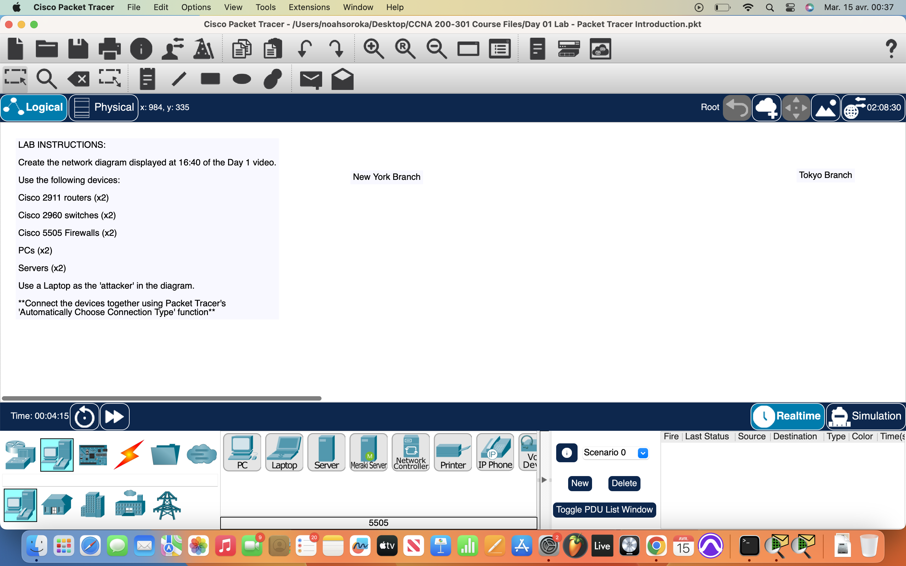
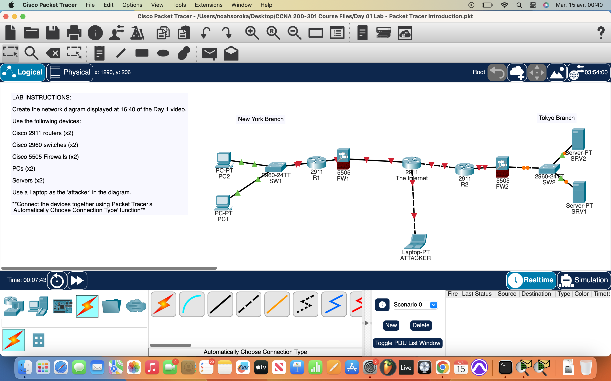
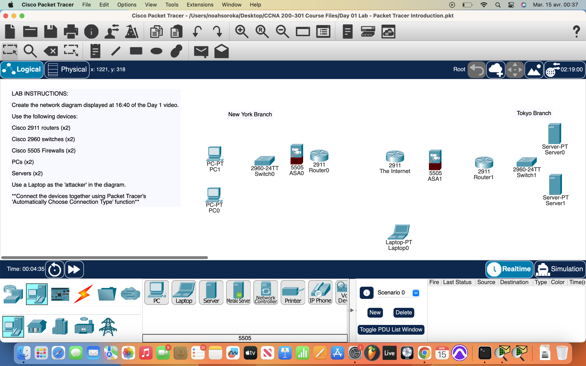

# Packet Tracer Lab 1 — First Network Setup #

---

## Summary ##

This was my first go at using **Cisco Packet Tracer**. It was a light session, just getting familiar with the interface and basic layout of things. Nothing fancy yet — just enough to get the ball rolling.

---

## What I Did ##

- Explored the **Packet Tracer interface** for the first time.
- Made a few **preference changes** for comfort and visibility.
- Built a **rudimentary first network** using Cisco infrastructure:
  - Added routers, switches, and endpoint devices.
  - Used the **automatic connection tool** to link everything up easily.

---

## Network Overview ##

I created two basic LANs representing:

- **New York Branch**
- **Tokyo Branch**

Each branch:
- Had its own **endpoints** connected through a switch.
- Was **protected by a router** acting as a perimeter device.
- Was **secured with a firewall** to prevent intrusions from external sources.

Both routers were configured to allow communication between the branches. However, firewalls on both LANs effectively blocked the attacker from accessing the internal network — demonstrating basic **network segmentation** and **perimeter defense**.

---

## Screenshots ##

Here's what it looked like:

---

## Wrap-up ##

Overall, a chill first step into Packet Tracer and a little summary with some MD formatting, making it look spiffy. Learned the ropes, made a network, added some defense. More to come. 

