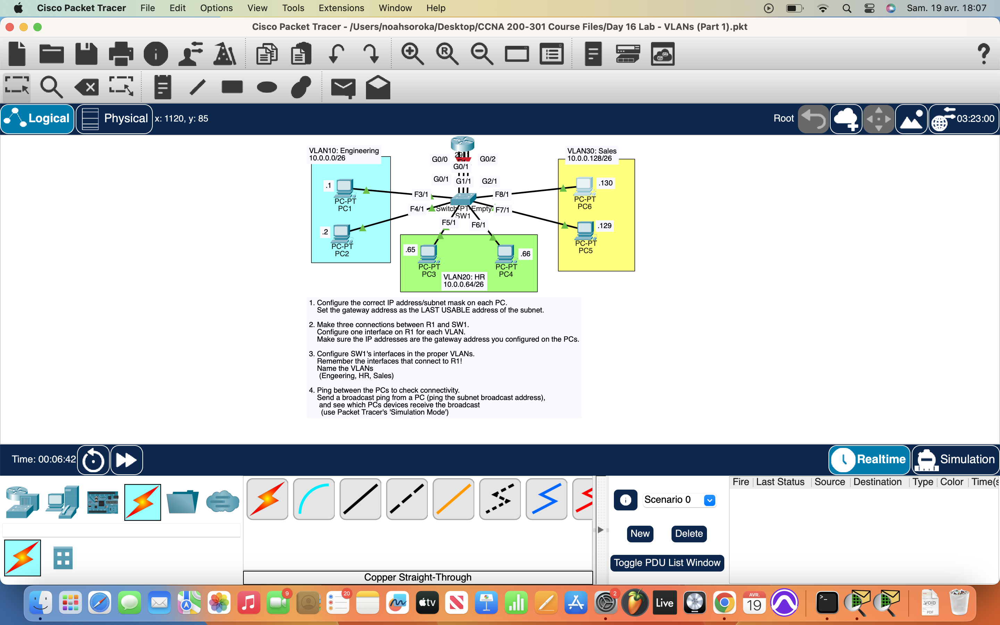
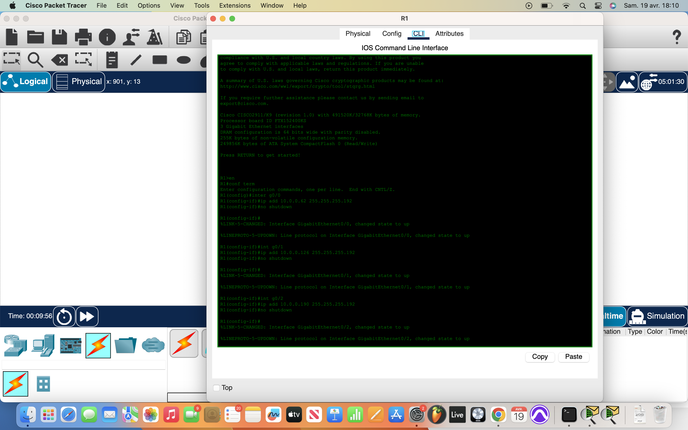
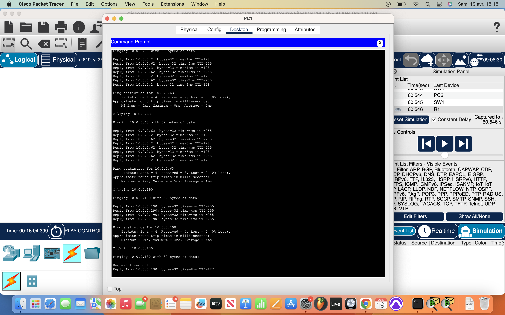

# Packet Tracer Lab 16 — VLAN Segmentation & Subnet Isolation #

---

## Summary ##

This lab was all about **manually segmenting a Layer 2 switch** using VLANs and assigning subnets to interfaces on a router. Instead of relying on trunking or dynamic assignments, I did everything by hand — from cabling to IP configuration — using **/26 subnetting** and static addressing to keep everything clean and predictable.

---

## What I Did ##

- Assigned **manual IPs** and **/26 subnet masks (255.255.255.192)** to all endpoints.
- Assigned the **default gateway** to each device corresponding to its subnet.
- Connected **three straight-through cables** from the router (R1) to the switch across 3 separate ports — each for a different VLAN. No trunking yet.
- On **R1**, configured each interface with an IP address acting as the gateway for its respective subnet.
- Entered the **switch CLI** and created:
  - `vlan 10`
  - `vlan 20`
  - `vlan 30`
- Assigned switch ports to the appropriate VLANs based on the subnet each PC belonged to.
- Verified segmentation and routing:
  - Used **simulation mode** to view how traffic from one PC to another was routed from switch → router → back to switch → destination.
  - Pings between devices in different subnets succeeded as traffic passed through R1.
  - Pings to each subnet’s **broadcast address** confirmed that broadcasts stayed within their assigned VLAN and didn’t leak to others.

---

## Network Overview ##

The topology included:
- **One Layer 2 switch**
- **One router (R1)** with three interfaces acting as gateways for three /26 subnets
- **Three subnets**, each on its own VLAN (10, 20, 30)
- **Three PCs**, each belonging to a different VLAN

The lab confirmed that VLANs provide **Layer 2 segmentation**, and **inter-VLAN routing** works correctly when handled through separate physical interfaces on the router.

---

## Screenshots ##

  

---

## Wrap-up ##

This lab was key in showing how **VLANs isolate traffic at Layer 2**, and how to use a router to route between them without trunking. Simulation mode was helpful to visualize how packets flow through the router and return to the appropriate VLAN. Clean manual setup — no automation, no DHCP — just raw control.
