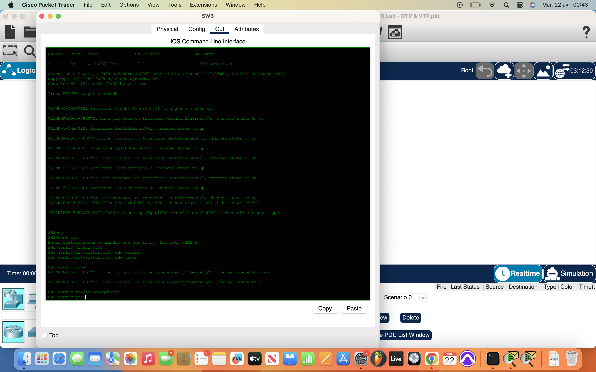
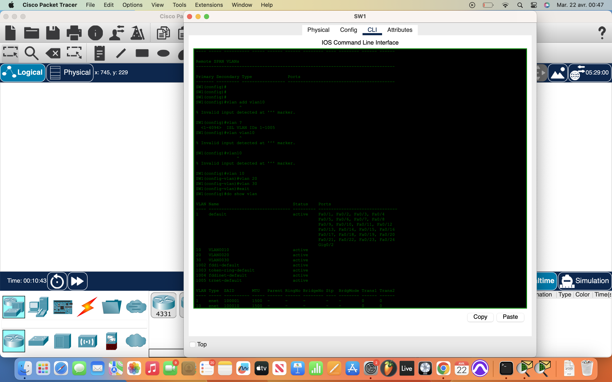
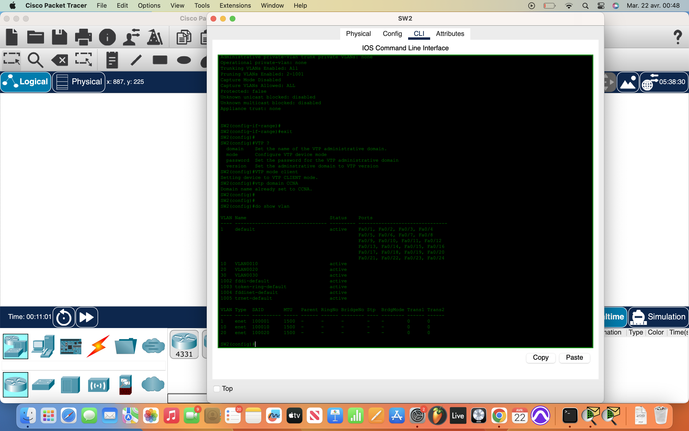
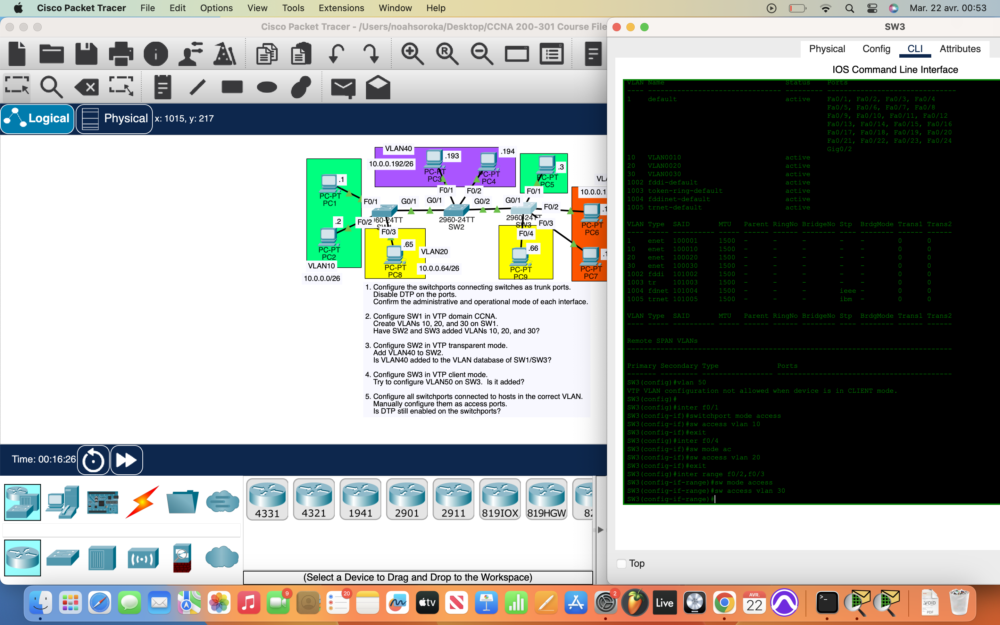

# Packet Tracer Lab 19 — VTP, VLANs and DTP negotiation #

---

## Summary ##

In this nineteenth lab, I practiced configuring **VTP (VLAN Trunking Protocol)** across three switches, manually assigning VLANs, activating hard trunking, and disabling DTP (Dynamic Trunking Protocol). The objective was to understand how VLANs propagate in VTP server/client modes and how transparent mode isolates custom VLANs from VTP syncing.

---

## What I Did ##

- **Manually configured trunk links** between all inter-switch connections:
  - Set `switchport mode trunk` to hardcode trunking.
  - Disabled DTP negotiation with `switchport nonegotiate`.
  - Verified trunk status using `do show interfaces trunk`.

- Set **SW1** as the **VTP server**, and added it to the `"CCNA"` VTP domain:
  - Created VLANs 10, 20, and 30.
  - Observed VLAN propagation to SW2 and SW3 once they were in **client mode**.

- Changed **SW2** to **VTP transparent** mode:
  - Created **VLAN40** locally on SW2.
  - Verified that **VLAN40 did not propagate** to SW1 or SW3 (as expected in transparent mode).

- Tested limitations of **VTP client** mode on **SW3**:
  - Attempted to create **VLAN50**, but the switch blocked the change since client mode doesn’t allow VLAN creation or deletion.

- Configured **access ports** on each switch:
  - Used `interface range` to assign correct VLANs to host-facing ports.
  - Explicitly set `switchport mode access` on all access interfaces.
  - Verified that **DTP was disabled** on access ports — only active on trunks.

- Completed full **end-to-end ping tests** between workstations:
  - Used simulation mode to trace how traffic moves between VLANs via trunk links.
  - ARP traffic and ICMP replies confirmed proper segmentation and routing behavior.

---

## Network Overview ##

- **SW1** = VTP Server — VLANs 10, 20, 30
- **SW2** = VTP Transparent — Local VLAN40 only
- **SW3** = VTP Client — Inherited VLANs 10, 20, 30

- All trunk ports statically defined, DTP disabled.
- Inter-VLAN communication functioned **post-ARP resolution** due to proper trunk configuration.

---

## Screenshots ##

  

  
  

---

## Wrap-up ##

This lab cemented my understanding of **VTP modes**, VLAN database propagation, and the critical role of **manual trunking when disabling DTP**. Using transparent mode showed how localized VLANs stay isolated, and client mode proved to be entirely dependent on the server. Everything was statically controlled, top-down, no automation — just pure config discipline.
