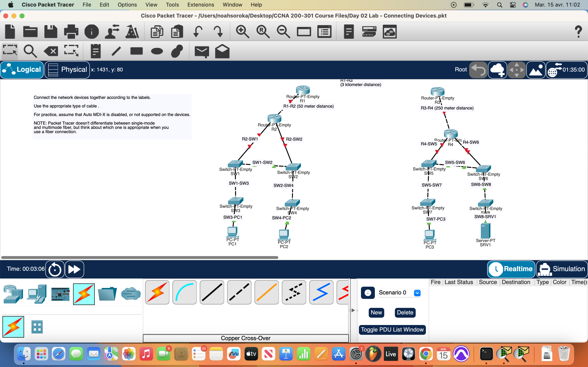
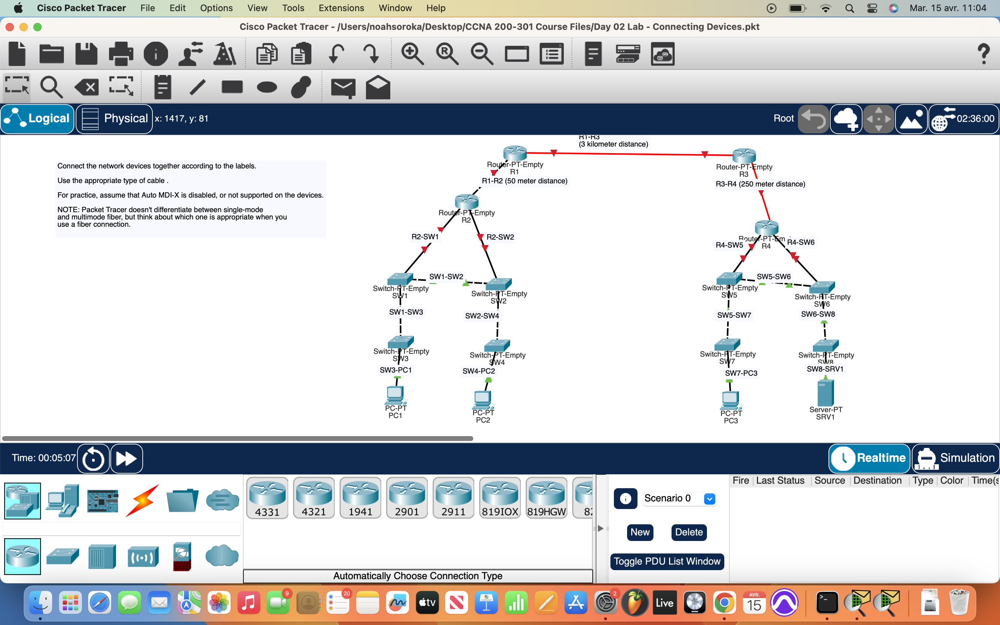

# Packet Tracer Lab 2 — Node Types & Manual Cabling #

---

## Summary ##

In this second session, I focused on how different node types communicate and how that affects cabling. This time around, I didn’t rely on the auto-connect tool — I handled cable selection manually, assuming **Auto-MDIX was disabled**, which meant picking the right cable was essential for link success.

---

## What I Did ##

- Connected **different node types** (routers, switches, endpoints) based on Tx/Rx logic:
  - Used **straight-through cables** to link endpoints (like PCs) to switches.
  - Used **crossover cables** for same-type device connections (e.g., switch-to-switch or router-to-router).
- Considered **fiber optic cabling** (via SFP+) where **distance exceeded UTP limitations**.
- Ensured all devices were able to communicate effectively once connected.

---

## Network Overview ##

The lab simulated a **multi-subnet network** stretching across a **3 km link**:

- Two subnet zones, each with:
  - Switches
  - Endpoints
  - Routers for segmentation and routing
- **Fiber connection** bridged the gap between the routers using SFP+ modules in switches to maintain link integrity over long distance.
- Manual cable selection was key since **Auto-MDIX was off** — Tx/Rx pin alignment had to be correct to avoid dead links.

All devices communicated successfully across both subnets with **no misconfigurations or signal issues**.

---

## Screenshots ##

  
  

---

## Wrap-up ##

This lab was about the fundamentals: **understanding physical layer connections** and how proper cabling directly affects communication. A good mix of logic and structure — built clean, connected right, and worked without relying on smart defaults.
