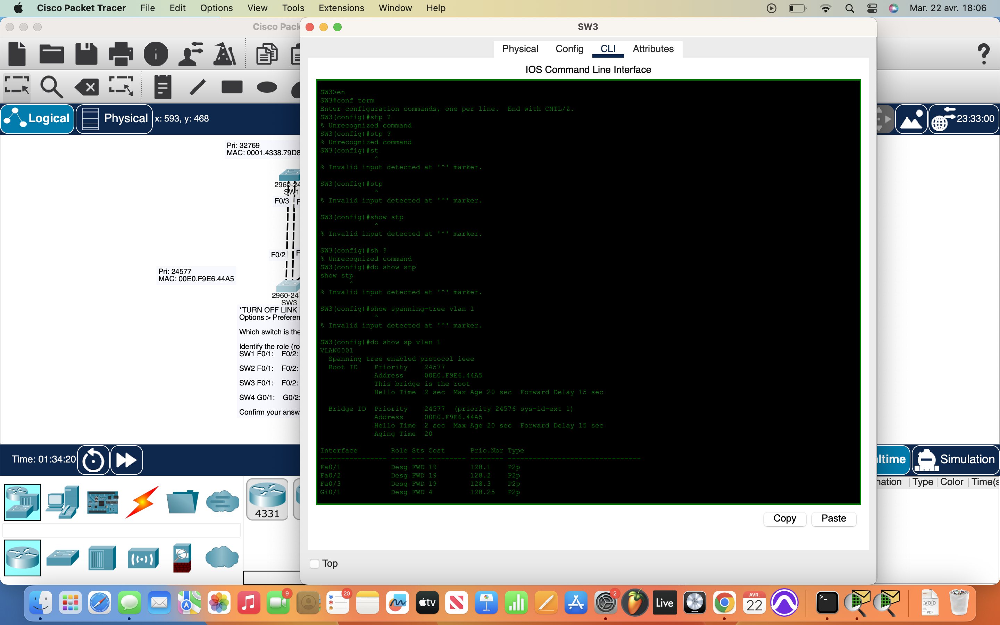
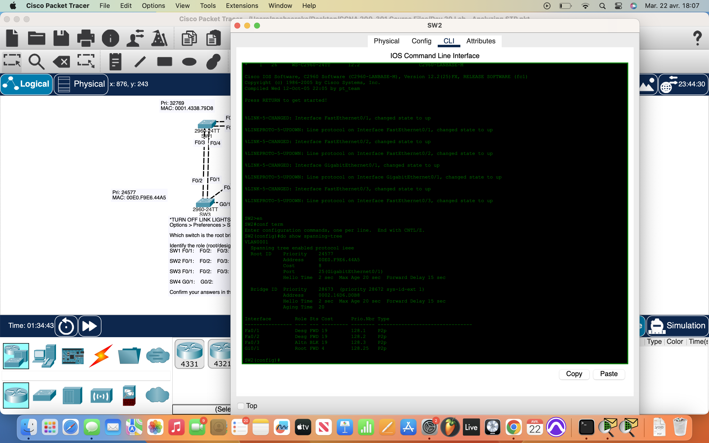

# Packet Tracer Lab 20 — STP Role Identification & Root Bridge Discovery #

---

## Summary ##

In this twentieth lab, the focus was on **Spanning Tree Protocol (STP)** and understanding how switches elect a root bridge and assign port roles. To simulate a real STP troubleshooting scenario, I first **disabled link lights** to prevent visual hints — no cheating, just logic and CLI output.

---

## What I Did ##

- **Turned off link lights**:
  - Went to `Options > Preferences > Interface` and unchecked **"Show Link Lights"** to force reliance on STP logic, not visual cues.

- **Identified the root bridge**:
  - Used `do show spanning-tree` on each switch to examine **Bridge ID** and **Priority** values.
  - Compared values to identify the **lowest Bridge ID**, which confirmed the **root bridge**.

- **Determined STP port roles**:
  - On each switch, I examined the **FastEthernet and GigabitEthernet interfaces**.
  - Based on their **connection to the root bridge**, I logically guessed:
    - **Root Ports** (R) = Ports with best path to root.
    - **Designated Ports** (D) = Forwarding ports for a LAN segment.
    - **Non-Designated (Blocked)** = Redundant links STP disables to prevent loops.

- **Confirmed answers via CLI**:
  - Ran `do show spanning-tree` on all switches.
  - Verified port roles (Root, Designated, or Blocking) as displayed in the output.

---

## Network Overview ##

Each switch had a set of FastEthernet and/or GigabitEthernet ports forming a **mesh-like topology**. The root bridge was determined based on the **lowest combination of priority and MAC address**.

The **CLI confirmation** was key to understanding how STP interprets the topology and prevents broadcast storms by:
- Electing a single **root bridge**
- Assigning **Root Ports** on all non-root switches
- Designating **blocked interfaces** to prevent loops

---

## Screenshots ##

  
  

---

## Wrap-up ##

This lab was about **visual discipline and logic application**. By turning off link lights, I had to rely on **STP fundamentals** — bridge priorities, port costs, and CLI output — to navigate and understand the switching hierarchy. The `show spanning-tree` command is now locked into muscle memory. Easy win, no shortcuts.
