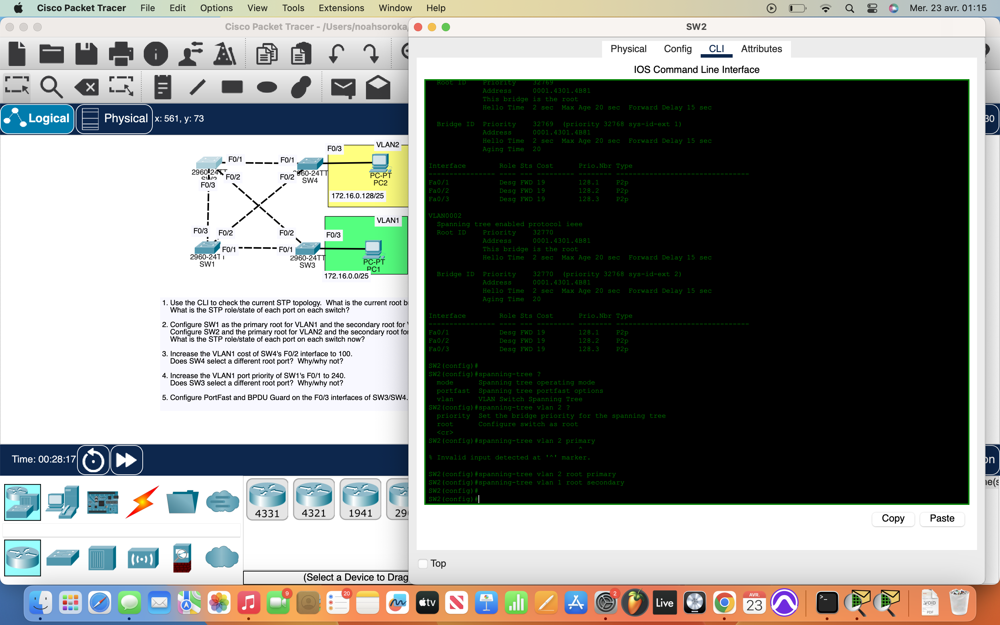
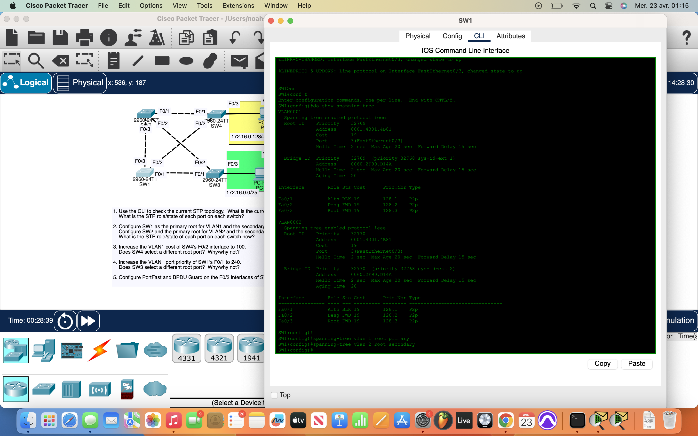
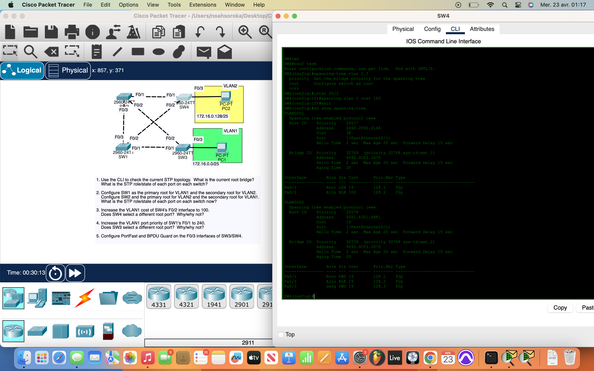
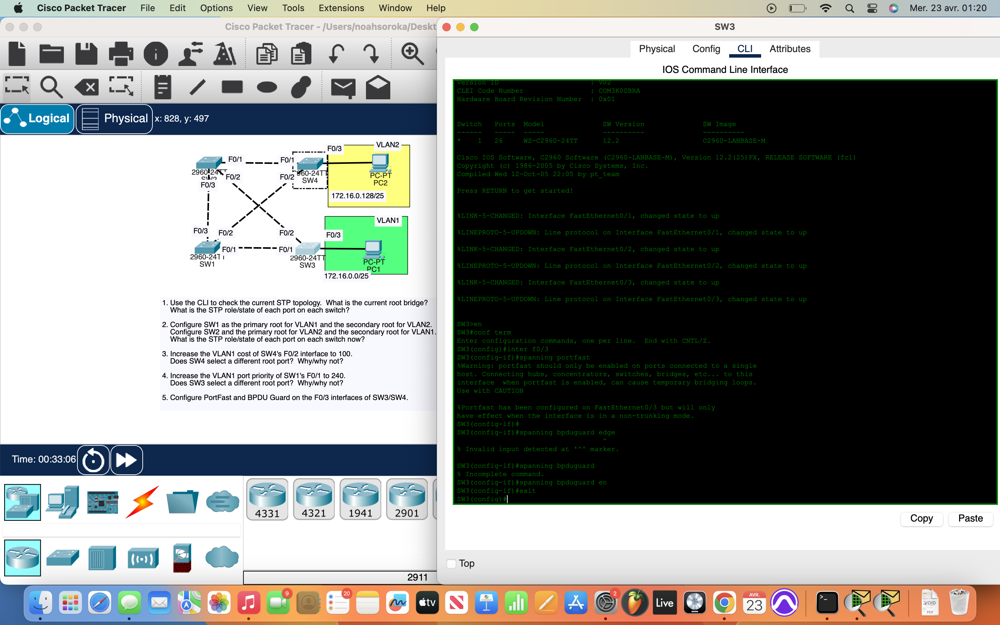

# Packet Tracer Lab 21 — Advanced STP Topology Control #

---

## Summary ##

This lab focused on **manipulating STP behavior** across **multiple VLANs**. Rather than just identifying port roles, I configured **per-VLAN root bridge elections**, adjusted **port costs** and **priorities**, and applied **port security mechanisms** (PortFast and BPDU Guard) to strengthen topology control and convergence speed.

---

## What I Did ##

- **Identified the current STP topology**:
  - Ran `do show spanning-tree` to inspect **priority values**, **MAC addresses**, and the “This bridge is the root” indicator.
  - Determined that **SW2** was the root bridge by default.

- **Manually set root bridge roles by VLAN**:
  - Configured **SW1** as:
    - Primary root for **VLAN 1** → `spanning-tree vlan 1 root primary`
    - Secondary root for **VLAN 2** → `spanning-tree vlan 2 root secondary`
  - Configured **SW2** as:
    - Primary root for **VLAN 2** → `spanning-tree vlan 2 root primary`
    - Secondary root for **VLAN 1** → `spanning-tree vlan 1 root secondary`
  - This forced **differentiated topologies per VLAN**, ensuring **no interface was blocked** in both VLANs simultaneously.

- **Tweaked STP path selection**:
  - On **SW4**, set `spanning-tree vlan 1 cost 100` on interface **F0/2** to artificially increase the path cost.
    - This caused SW4 to **select an alternate root port**, showing how cost metrics influence STP decisions.
  - On **SW1**, changed the **port priority** of **F0/1** to 240 (`spanning-tree vlan 1 port-priority 240`) to observe STP path recalculations.
    - This adjustment potentially **changed SW3's root port**, depending on the topology.

- **Enabled PortFast and BPDU Guard on edge interfaces**:
  - On **SW3 and SW4**, enabled:
    - `spanning-tree portfast` and `spanning-tree bpduguard enable` on **F0/3** interfaces (the ones connected to endpoints).
    - This allows **instant link forwarding** while **protecting against rogue switch connections**.

---

## Network Overview ##

This was a **layer 2-focused lab**, where fine-tuned STP controls were implemented for **VLAN 1 and VLAN 2** separately:

- **Root bridges were deliberately assigned** to avoid redundancy across VLANs.
- Port roles (Root, Designated, or Alternate) varied per VLAN.
- **Edge ports were hardened** to support faster client connections while defending against topology changes from unauthorized switches.

---

## Screenshots ##

  

  
  

---

## Wrap-up ##

This lab proved how **precise control over STP** leads to optimized network behavior. From **manual root bridge configuration**, to **influencing port roles** with costs and priorities, and finally **protecting edge ports** with PortFast and BPDU Guard — this was a deep dive into real-world switching stability strategies.
