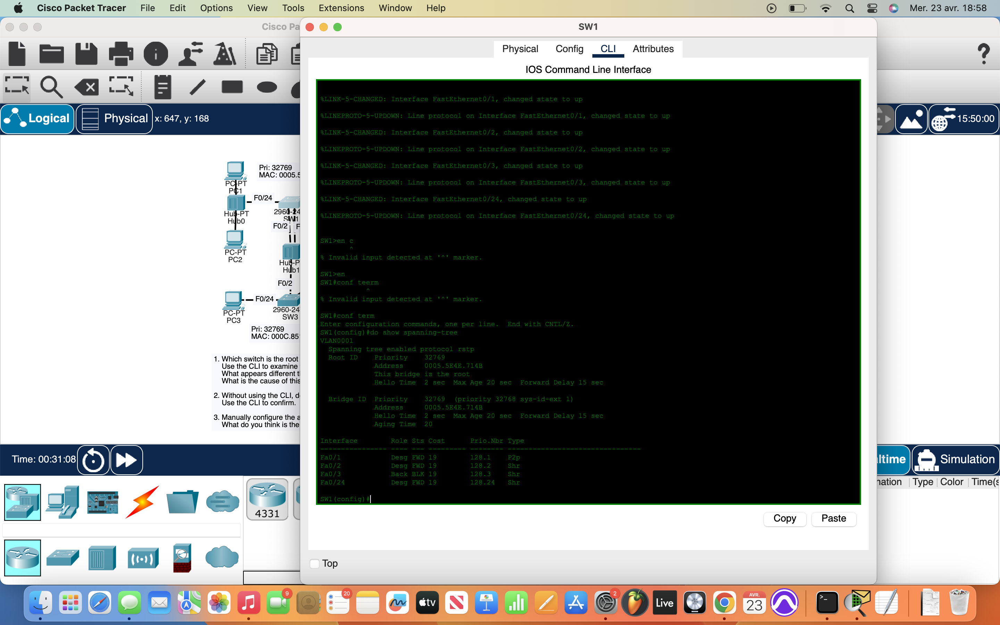
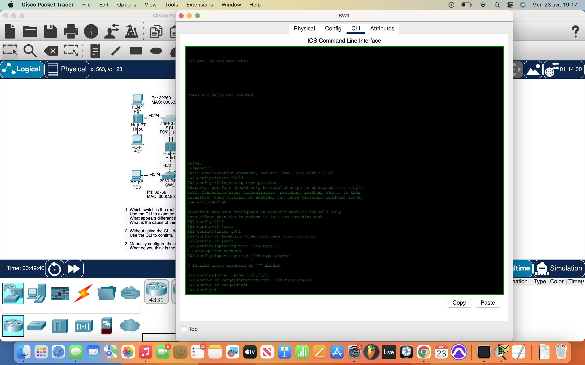

# Packet Tracer Lab 22 — RSTP Link Types & Interface Roles #

---

## Summary ##

This lab focused on **Rapid Spanning Tree Protocol (RSTP)** and how link types influence the convergence process. Unlike traditional STP, RSTP can detect and respond to topology changes much faster — especially when the **link type is correctly defined**. This exercise was all about understanding and manually configuring those link types based on the connected device type.

---

## What I Did ##

- **Identified the root bridge** by using `do show spanning-tree` and noting:
  - The **bridge ID**
  - **Priority**
  - The “This bridge is the root” statement
- Mapped out the **RSTP port roles and states** for each interface on each switch.
  - This included Root Ports, Designated Ports, and any Alternate (discarding) ports.

- Configured **RSTP link types** per interface:
  - Used `spanning-tree link-type point-to-point` for **switch-to-switch** connections (full-duplex).
  - Used `spanning-tree link-type shared` for ports connected to **hubs**, since those are shared half-duplex mediums.
  - Enabled **PortFast** on **egress interfaces** (ports connected to PCs/endpoints) to allow **instant forwarding**:
    - `spanning-tree portfast`

---

## Network Overview ##

The network included a mix of:
- **Switches** (core of the STP/RSTP behavior)
- **Endpoints** (PCs)
- **Hubs** (used to demonstrate shared-medium behavior)

By identifying and explicitly setting the correct link types, the network could **converge faster and more predictably** under RSTP. This is especially helpful in networks with older shared segments or mixed full-/half-duplex environments.

---

## Screenshots ##

  
  

---

## Wrap-up ##

This lab emphasized **precision in RSTP tuning**. Correctly setting link types to **point-to-point**, **shared**, or enabling **portfast** made the difference in how quickly and cleanly the network adapted. Small configs, big impact — and a good reminder that **knowing your topology helps shape how fast it recovers**.
