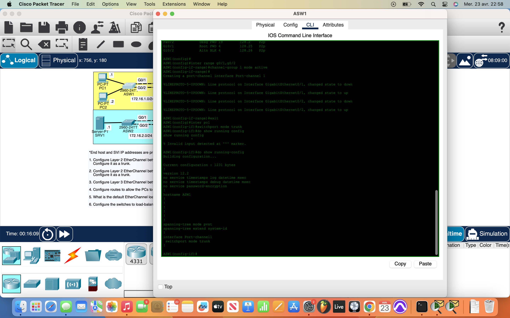
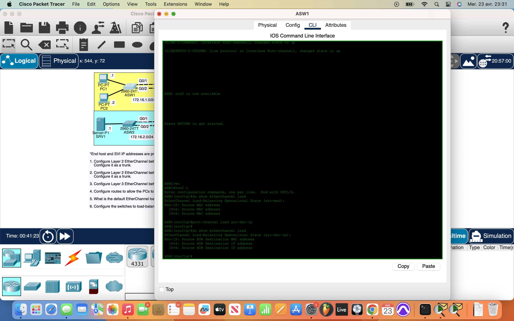

# Packet Tracer Lab 23 — EtherChannel: LACP, PAgP, and Static L3 #

---

## Summary ##

This lab focused on building **redundant aggregated links** using EtherChannel in both Layer 2 and Layer 3 topologies. The objective was to configure dynamic and static channel groups using **LACP**, **PAgP**, and **manual (on)** modes, ensure trunking worked, and verify Layer 3 routing functionality across switches.

---

## What I Did ##

- **Configured Layer 2 EtherChannel using LACP** between `ASW1` and `DSW1`:
  - Created a **channel-group** with `mode active` on both ends.
  - Verified EtherChannel with `show etherchannel summary`.
  - Ensured it was operating as a **trunk** link.

- **Configured Layer 2 EtherChannel using PAgP** between `ASW2` and `DSW2`:
  - Used `mode desirable` for both ends.
  - Also verified trunking and channel group bundling.

- **Configured Layer 3 EtherChannel using static “on” mode** between `DSW1` and `DSW2`:
  - Used `no switchport` on the participating interfaces.
  - Assigned an IP address to the **Port-Channel interface (Po2)**.
  - Set up **static routing** so that `PC2` could ping across subnets and reach `SRV1`.

- **Changed EtherChannel load-balancing method** on switches:
  - From default (usually source MAC or IP) to:
    - `port-channel load-balance src-dst-ip`
  - This ensures more efficient traffic distribution based on both source and destination IPs.

---

## Network Overview ##

- **Three EtherChannels in total**:
  - L2 LACP trunk (ASW1 ↔ DSW1)
  - L2 PAgP trunk (ASW2 ↔ DSW2)
  - L3 static routed trunk (DSW1 ↔ DSW2)

- Default EtherChannel load-balancing was checked with:
  - `show etherchannel load-balance`
- Updated to use `XOR of source and destination IP` for more balanced traffic flow between devices.

---

## Screenshots ##

  
  

---

## Wrap-up ##

This lab showed how **EtherChannel** simplifies configuration and adds redundancy while also supporting both L2 and L3 topologies. Whether using **LACP, PAgP**, or static “on”, the end result is efficient link aggregation. Combining that with correct routing and smart load-balancing means better performance across the board — **no blocked ports, no wasted bandwidth**.
