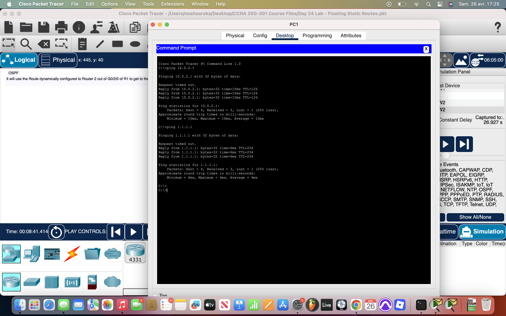
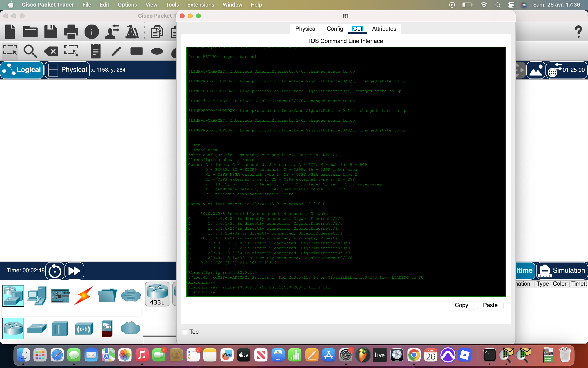
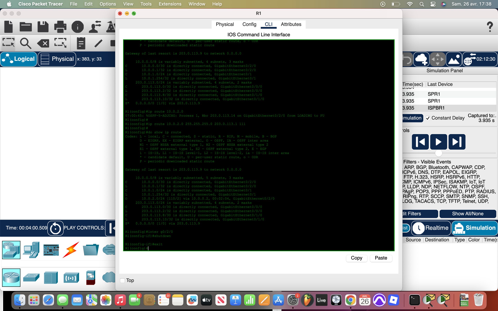
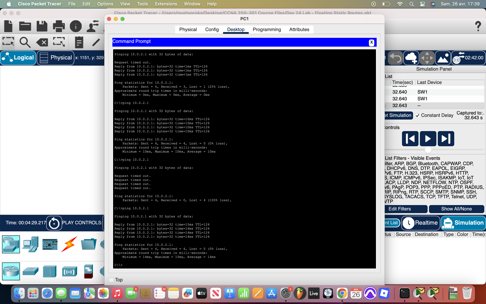

# Packet Tracer Lab 24 — OSPF and Floating Static Routes #

---

## Summary ##

This lab focused on **dynamic routing using OSPF** and how to back it up with **floating static routes**. The goal was to make sure network traffic could still reach critical services (like SRV1) even if the primary OSPF link failed, ensuring high availability and redundancy without manual intervention.

---

## What I Did ##

- **Checked the routing tables** on `R1` and `R2`:
  - Confirmed **OSPF** was active with a default **administrative distance (AD) of 110**.
  - Verified the dynamic OSPF routes connecting the two LANs.

- **Analyzed live traffic flow**:
  - Used **simulation mode** to watch PC1 ping SRV1.
  - Saw packets travel via the **OSPF-learned route** between routers.
  - Also pinged `1.1.1.1` (Internet server) — traffic went out through the LAN's default gateway ISP router directly, without needing to cross over to the other LAN first.

- **Configured floating static routes**:
  - Added backup static routes on `R1` and `R2` with an **AD of 111** (one higher than OSPF) to stay in standby mode.
  - Used the **ISP1-side link** as the backup path.

- **Tested failover**:
  - **Admin shutdown** was performed on the `G0/2/0` interface of `R1`.
  - Retested ping from PC1 to SRV1.
  - Confirmed that traffic successfully rerouted using the floating static path, with all pings returning successfully.

---

## Network Overview ##

- **Primary path**:  
  - OSPF dynamic routing between `R1` and `R2`.

- **Backup path**:
  - Floating static route configured to take over when the OSPF-learned direct link fails.

- **Internet access**:
  - Each LAN has its own ISP router as the gateway to the Internet.
  - No dependency between LANs for Internet access — each LAN independently reaches the Internet.

All objectives were achieved, and the floating static routes properly entered the routing tables during failover.

---

## Screenshots ##

  
  
   
   

---

## Wrap-up ##

This lab emphasized **dynamic vs static routing** interaction, especially around **failure recovery**. Floating static routes are a simple but powerful way to provide resilience when primary dynamic paths go down, allowing the network to heal itself automatically without manual reconfiguration.
