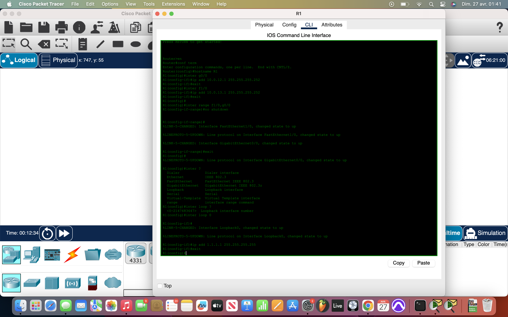
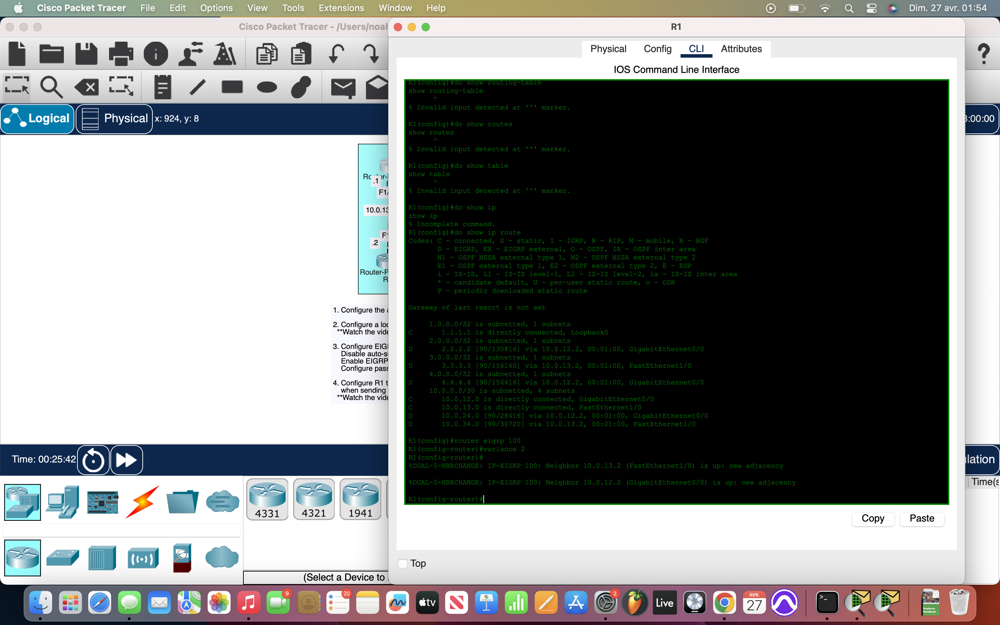

# Packet Tracer Lab 25 — EIGRP, Loopbacks, and Unequal-Cost Load Balancing #

---

## Summary ##

This lab focused on **setting up EIGRP** across a **four-router network**, including loopback configurations and passive interfaces. The final objective was to enable **unequal-cost load balancing** using EIGRP’s `variance` command, making traffic from the PC to R1’s loopback interface take multiple paths.

---

## What I Did ##

- **Initial Device Setup**:
  - Assigned **hostnames** (`R1`, `R2`, `R3`, `R4`) to all routers.
  - Configured **IP addresses** and **subnet masks** on every router interface for their respective `/30` point-to-point links.
  - Entered into **interface ranges** and issued `no shutdown` to bring all router interfaces up.

- **Loopback Interface Configuration**:
  - Created a **Loopback0** interface on each router:
    - `R1`: `1.1.1.1 /32`
    - `R2`: `2.2.2.2 /32`
    - `R3`: `3.3.3.3 /32`
    - `R4`: `4.4.4.4 /32`

- **EIGRP Setup**:
  - Activated **EIGRP** using **AS 100** on all routers.
  - Issued `no auto-summary` on each router.
  - Used `network 0.0.0.0 255.255.255.255` to enable EIGRP on all interfaces quickly instead of manually listing each network.
  - Set **passive interfaces** for:
    - All loopbacks.
    - R4’s LAN-facing interface toward the PC.

- **Verification**:
  - Checked `show ip route` to ensure EIGRP adjacencies and routes were properly established.
  - Confirmed loopback and LAN networks were properly reachable across routers.

- **Unequal-Cost Load Balancing**:
  - On `R1`, configured `variance 2`.
  - Observed that multiple paths (via `R2` and `R3`) to `192.168.4.0/24` were added into the routing table.
  - Used **simulation mode** to ping R1's loopback from the PC and watched packets successfully load-balance across both paths.

---

## Network Overview ##

- Four routers (`R1` to `R4`) connected through `/30` subnets.
- Loopback interfaces on each router simulated internal networks.
- PC connected behind `R4`, representing a user endpoint.
- EIGRP dynamically routed all traffic.
- Variance enabled **multipath routing**, optimizing traffic load across available links.

All routers learned each other's loopbacks and LANs, and traffic from the PC successfully balanced over unequal paths from `R4` → `R2`/`R3` → `R1`.

---

## Screenshots ##

  
  
  

---

## Wrap-up ##

This lab solidified **dynamic EIGRP configuration** basics and introduced **EIGRP load balancing across unequal-cost paths**. Automating failover and performance balancing using variance is a key benefit of distance-vector protocols like EIGRP, and setting it up was straightforward once the network topology was clean and passive interfaces were properly selected.
