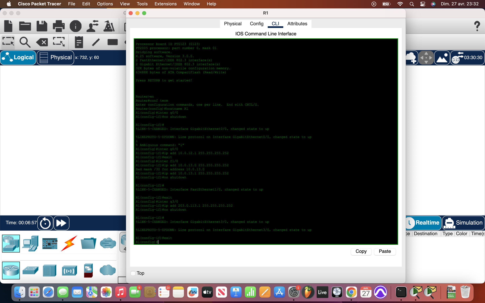
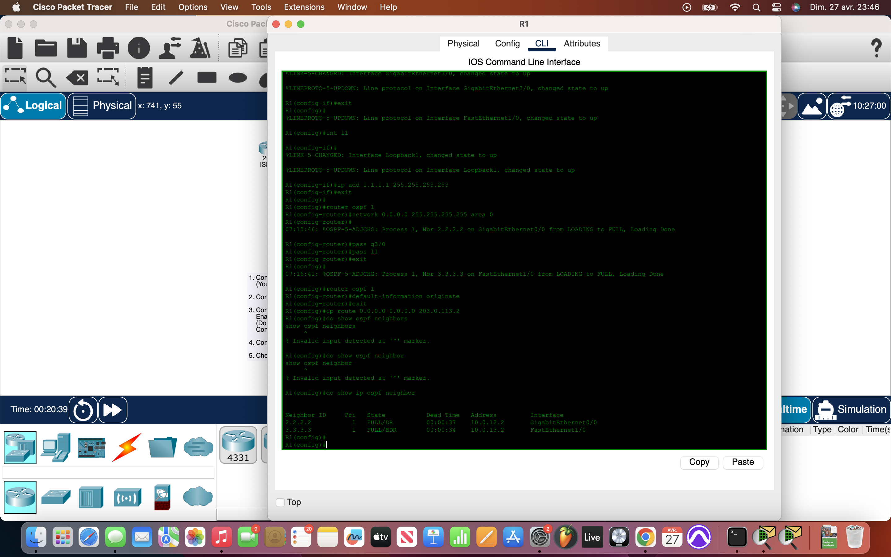
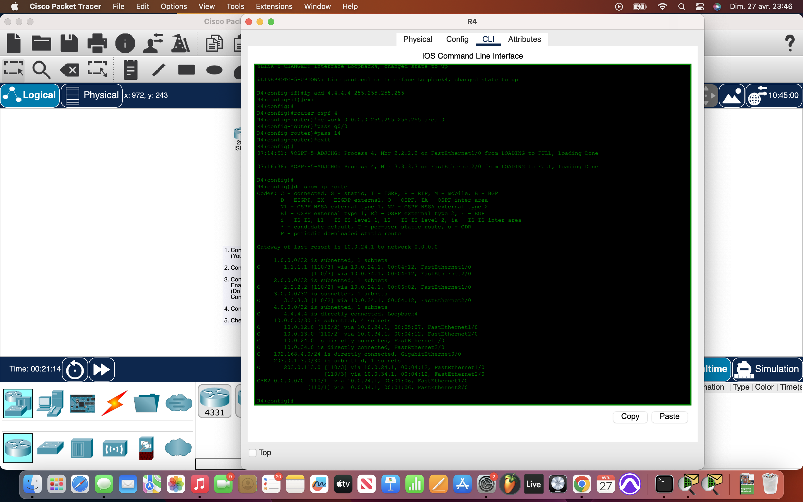

# Packet Tracer Lab 26 — OSPF Setup with ASBR and Default Route Advertisement #

---

## Summary ##

This lab was about **configuring OSPF** across a **multi-router network**, setting up passive interfaces where needed, and using **default-information originate** to advertise a default route into the OSPF domain. The goal was full network reachability, including access to the external ISP router from the internal PC.

---

## What I Did ##

- **Initial Device Setup**:
  - Assigned **hostnames** to all routers (`R1`, `R2`, `R3`, `R4`).
  - Configured **IP addresses** on all router interfaces.
  - Issued `no shutdown` on every router interface to bring them up.
  - Configured **default gateway** for `PC1` to point to `R4`.

- **Loopback Interface Configuration**:
  - Created a **Loopback0** on each router:
    - `R1`: `1.1.1.1 /32`
    - `R2`: `2.2.2.2 /32`
    - `R3`: `3.3.3.3 /32`
    - `R4`: `4.4.4.4 /32`

- **OSPF Configuration**:
  - Used `router ospf [process-id]` on each router.
  - Activated OSPF on all interfaces with a lazy shortcut: `network 0.0.0.0 255.255.255.255 area 0`.
  - Set **passive interfaces** on:
    - All loopbacks.
    - Endpoint-facing interfaces (e.g., PC links) to prevent unnecessary OSPF hello traffic.

- **ASBR and Default Route Advertisement**:
  - On `R1`, configured `default-information originate` under OSPF to **advertise a default route**.
  - This enabled routers downstream (`R2`, `R3`, `R4`) to use `R1` as the gateway of last resort toward the Internet.

- **Verification**:
  - Checked routing tables with `show ip route` on all routers.
  - Observed OSPF routes properly populated, including the learned default route (`0.0.0.0/0`).
  - Successfully **pinged the ISP router** (`ISPR1`) from the `PC1` endpoint, confirming that the entire route path was functional after initial ARP resolution.

---

## Network Overview ##

- Four internal routers (`R1`, `R2`, `R3`, `R4`) and one external ISP router (`ISPR1`).
- Internal routers fully OSPF-meshed within **Area 0**.
- `R1` acted as the **Autonomous System Boundary Router (ASBR)**.
- Default route to the ISP propagated throughout the internal network via OSPF.
- Passive interfaces reduced OSPF overhead and noise on irrelevant links (loopbacks and PC connections).

All routers correctly learned the default route through R1, enabling seamless internal-to-external traffic flow.

---

## Screenshots ##

  
  
  

---

## Wrap-up ##

This lab reinforced critical OSPF skills: **area configuration**, **passive interface selection**, and **default route injection** using ASBR functionality. Mastering these steps ensures scalable and efficient OSPF deployments, especially when external connectivity is involved.
