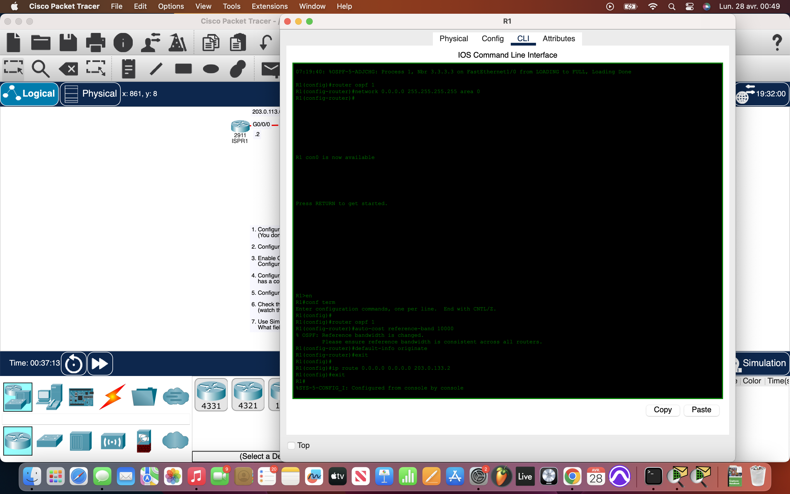
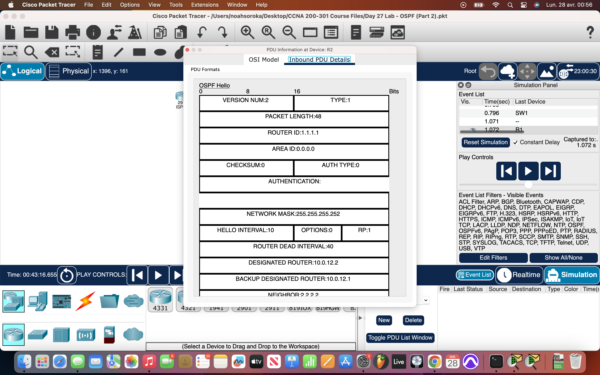

# Packet Tracer Lab 27 — OSPF Setup with Cost Adjustments and Hello Packet Analysis #

---

## Summary ##

This lab built directly off the previous one — setting up **OSPF** across a network of routers, but adding two key elements: **cost tuning** for better route selection and **packet analysis** of OSPF Hello messages. The goal remained full connectivity, but with more control over routing behavior.

---

## What I Did ##

- **Initial Device Setup**:
  - Assigned **hostnames** (`R1`, `R2`, `R3`, `R4`) on each router.
  - Configured **IP addresses** on all router interfaces.
  - Issued `no shutdown` on each interface to activate links.
  - Set the **default gateway** for `PC1` toward `R4`.

- **Loopback Interface Configuration**:
  - Created **Loopback0** interfaces with `/32` IPs:
    - `R1`: `1.1.1.1 /32`
    - `R2`: `2.2.2.2 /32`
    - `R3`: `3.3.3.3 /32`
    - `R4`: `4.4.4.4 /32`

- **OSPF Configuration**:
  - Enabled OSPF on each router directly under interfaces.
  - Used **passive interfaces** for:
    - All loopbacks.
    - Endpoints (e.g., PC links).
  - Verified neighbor adjacency formed properly across active router-to-router links.

- **Cost Adjustments**:
  - Configured **OSPF reference bandwidth** to properly scale FastEthernet speeds:
    - Set `auto-cost reference-bandwidth 100` on each router.
  - This step ensured more realistic cost metrics instead of treating all Ethernet types the same.

- **ASBR and Default Route Advertisement**:
  - On `R1`, configured `default-information originate` under OSPF.
  - Advertised the default route throughout the OSPF domain, enabling routers and endpoints to reach external networks.

- **Packet Analysis**:
  - Used **Simulation Mode** in Packet Tracer to capture and inspect **OSPF Hello messages**.
  - Observed the following fields inside the Hello packets:
    - **Router ID**
    - **Hello/Dead intervals**
    - **Neighbors list**
    - **Network Mask**
    - **Area ID**
    - **Authentication type**
    - **Priority for DR/BDR elections**

- **Verification**:
  - Checked routing tables (`show ip route`) on `R2`, `R3`, and `R4`.
  - Confirmed presence of OSPF-learned routes and the default `0.0.0.0/0` route.
  - Successfully pinged `ISPR1` from `PC1` to validate end-to-end connectivity.

---

## Network Overview ##

- Four routers inside the OSPF domain (`R1` to `R4`) plus an external ISP router (`ISPR1`).
- All routers fully meshed through OSPF **Area 0**.
- `R1` acting as **ASBR**, injecting the external default route.
- Correct cost metrics after adjusting for real-world bandwidths on FastEthernet and GigabitEthernet links.
- OSPF Hello packets verified fields like priority, neighbors, timers, and area IDs to ensure proper adjacencies.

The routing environment was clean, efficient, and accurately reflected the correct link costs for better routing decisions.

---

## Screenshots ##

  
  

---

## Wrap-up ##

This lab refined the OSPF setup by introducing **reference bandwidth tuning** for better cost calculation and exploring **OSPF Hello packets** at the protocol level. A solid foundation for designing and troubleshooting OSPF networks more effectively.
