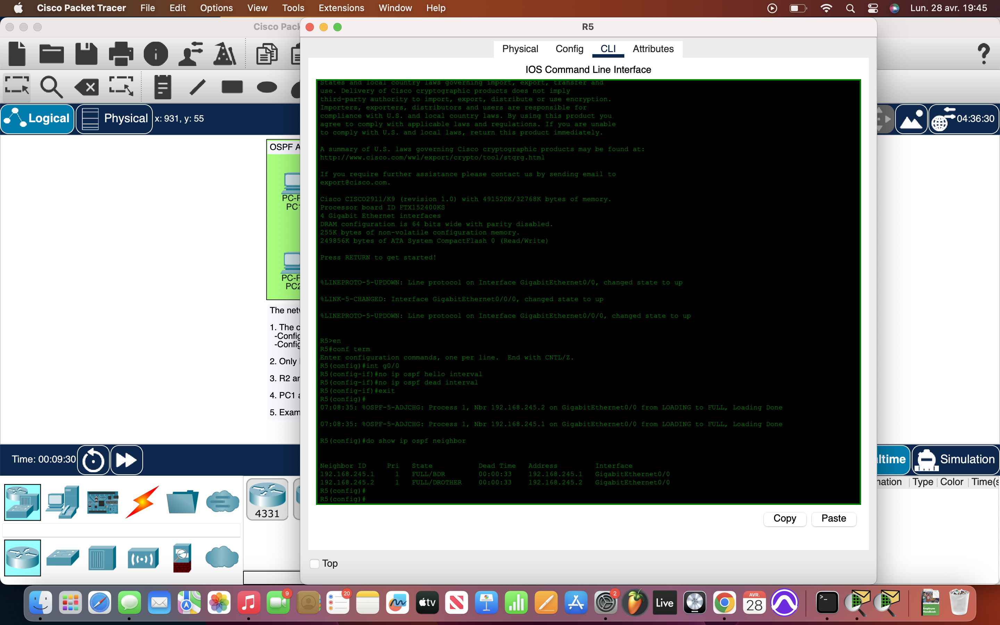
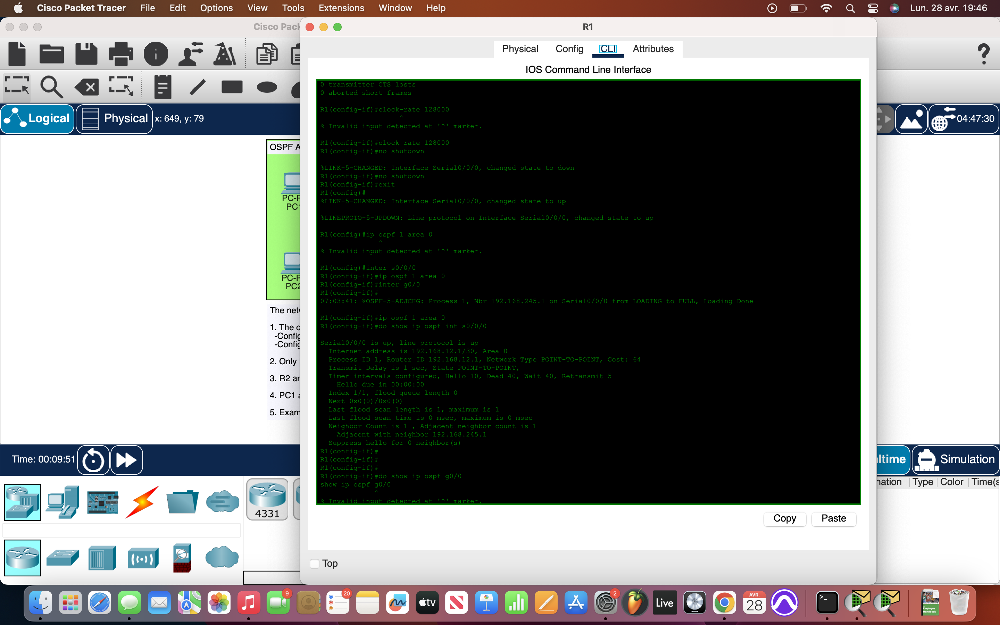

# Packet Tracer Lab 28 — Serial OSPF Activation, Neighbor Issues, and Default Route Fixes #

---

## Summary ##

This lab focused on troubleshooting and fixing OSPF across a pre-built network topology. I activated the new serial link between `R1` and `R2`, corrected wrong OSPF network types, fixed neighbor adjacency issues, repaired the missing default route advertisement, and finally inspected the OSPF LSDB to verify the presence of expected LSAs.

---

## What I Did ##

- **Serial Connection Activation (R1 ↔ R2)**:
  - Set **clock rate 128000** on the DCE side of the serial link.
  - Brought both interfaces up using `no shutdown`.
  - Activated **OSPF** on both R1 and R2 over the serial link.

- **Fixing Ethernet Link Configuration (R3 ↔ R4)**:
  - Found that the link between `R3` and `R4` was mistakenly configured as **Point-to-Point** in OSPF even though it was an Ethernet connection.
  - Reconfigured it to **broadcast** network type, allowing proper neighbor discovery without manual neighbor commands.

- **Fixing Hello/Dead Timer Mismatch (R5)**:
  - Discovered `R5` had different **hello** and **dead** intervals compared to `R2` and `R4`.
  - Reset R5's OSPF interface timers to the default:
    - Hello interval: 10 seconds
    - Dead interval: 40 seconds
  - After matching timers, R5 successfully formed adjacencies with R2 and R4.

- **Fixing Default Route Advertisement (Internet Access)**:
  - Found that `R5` had `default-information originate` configured but **no static default route**.
  - Added the missing static route:
    ```
    ip route 0.0.0.0 0.0.0.0 203.0.113.2
    ```
  - This allowed PC1 and PC2 to ping the external server (8.8.8.8) through the ASBR.

- **Inspecting the LSDB**:
  - Opened R5's **Link-State Database** and observed:
    - **Type 1 LSAs** (Router LSAs)
    - **Type 2 LSAs** (Network LSAs for multi-access networks)
    - **Type 5 LSAs** (External LSAs for the default route to the internet)

---

## Network Overview ##

- Five routers interconnected with a mix of **Ethernet** and **Serial** links.
- **OSPF Area 0** covering all routers.
- `R5` acting as the **ASBR** advertising default route to reach external networks.
- OSPF neighbor relationships fully established after fixing timers and network types.
- All PCs able to access the internet after static route correction on R5.

A solid troubleshooting session that walked through layer 2 mismatches, OSPF settings, and routing corrections methodically.

---

## Screenshots ##

  

  

---

## Wrap-up ##

This lab reinforced **real-world OSPF troubleshooting** — from interface clocking and network type corrections to timer alignment and default route propagation. A great practical drill on systematically uncovering and fixing multi-layer networking issues.
