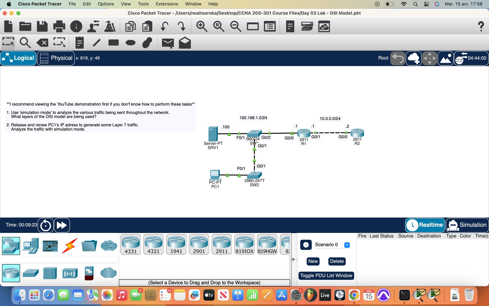
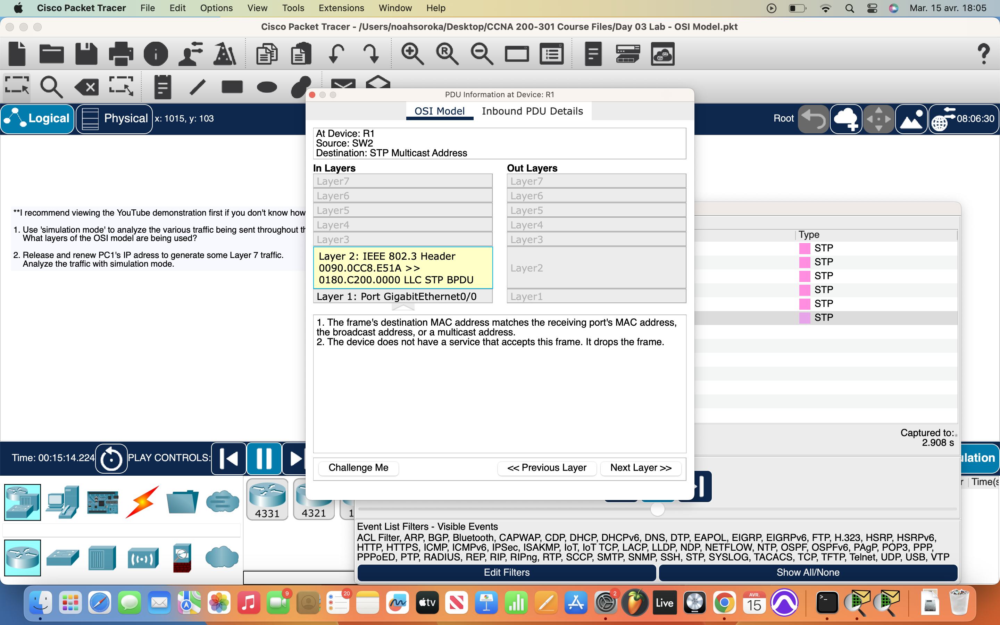
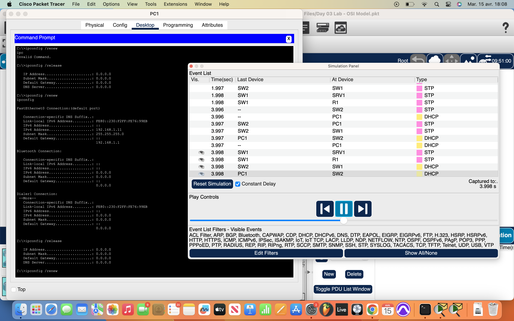

# Packet Tracer Lab 3 — Simulation Mode & OSI Layer Traffic #

---

## Summary ##

In this third session, I explored **Simulation Mode** to visualize how different protocols and devices interact across the OSI model. This lab was more observational — less building, more watching the network breathe and function.

---

## What I Did ##

- Launched the lab in **Simulation Mode** to track packet activity.
- Used the **PC CLI** to issue DHCP-related commands:
  - `ipconfig /release`
  - `ipconfig /renew`
- These commands refreshed the dynamic address assignment and triggered **Layer 7 traffic** (DHCP operations) to flow through the network.

---

## Network Behavior ##

While my main focus was DHCP and **observing the OSI layers**, several other protocols popped up:

- **ARP requests** were triggered during address resolution.
- **OSPF** and **RIP** routing updates started flowing because the network was already preconfigured and this was its **first simulation run**.
- I watched routing tables populate and broadcast packets move through the layers — everything from Layer 2 MAC activity to Layer 3 routing behavior.

---

## Screenshots ##

  
  
  

---

## Wrap-up ##

This lab emphasized **visibility** — using Simulation Mode to see what’s usually hidden. Watching live packet flow made the OSI layers feel real, not theoretical. A cool step forward into protocol dynamics and traffic behavior.
