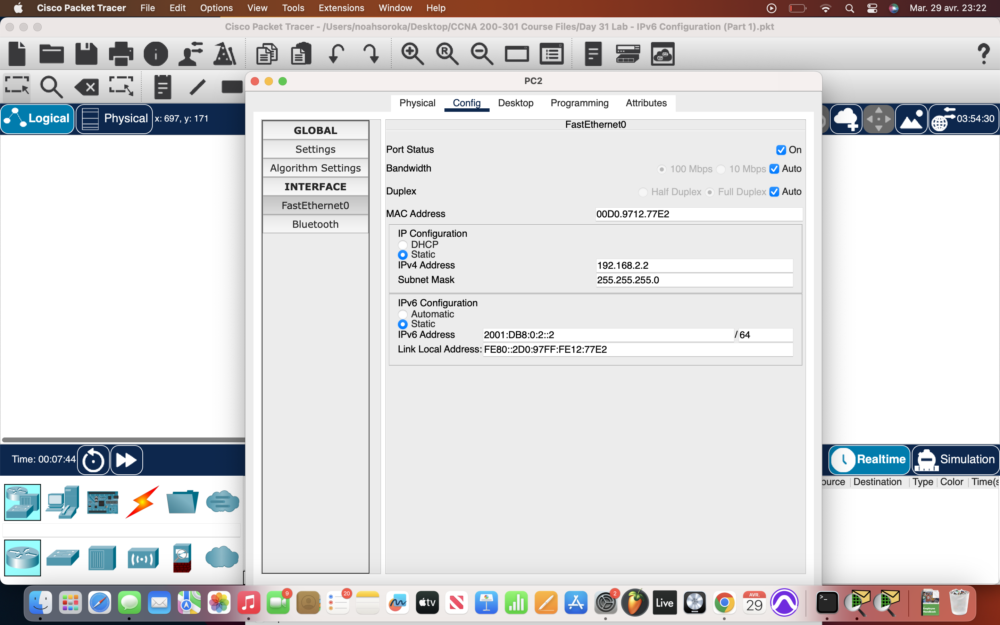
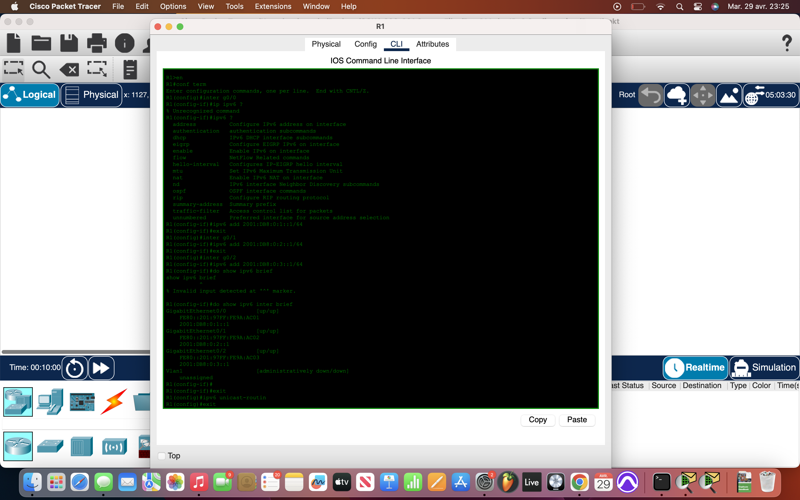
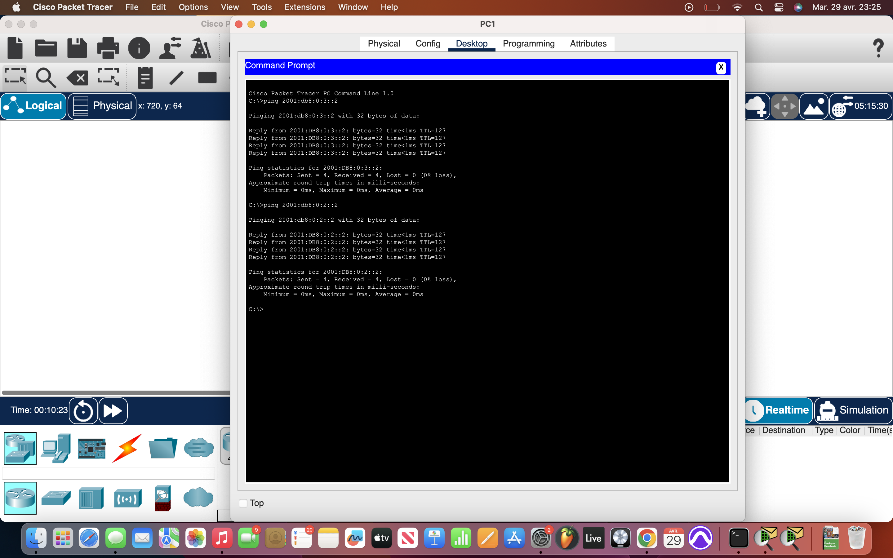

# Packet Tracer Lab 31 — IPv6 Dual Stack Configuration #

## Summary ##

This was the thirty-first Packet Tracer lab, where the focus shifted toward **dual-stack configuration** — enabling and verifying **IPv6 connectivity** alongside existing IPv4. The lab objective was to implement IPv6 on both the router and the endpoints, confirm link-local/global address behavior, and verify end-to-end IPv6 reachability across a simple routed topology.

---

## What I Did ##

- **Enabled IPv6 routing** on the router using `ipv6 unicast-routing`.
- Assigned **IPv6 global unicast addresses** directly via the router’s **interface config menus**.
- Verified configuration using `show ipv6 interface brief`:
  - Saw **expected link-local addresses** auto-generated.
  - Confirmed that manually set global addresses appeared correctly.
- Configured all **three endpoints** with:
  - Matching **IPv6 global addresses**
  - Correct **default gateways** for IPv6 routing
- Ran pings between the PCs using IPv6 addresses — everything worked fine:
  - All PCs could **ping each other** using IPv6 through the router.
  - No additional routing tweaks were needed — clean config, immediate success.

---

## Network Overview ##

A simple **dual-stack LAN topology** with a single router and three endpoint devices:

- **IPv4 was already pre-configured**.
- **IPv6 was layered in manually**:
  - Router had proper interface IPv6 addresses and `ipv6 unicast-routing` enabled.
  - Each PC was statically configured with an IPv6 address and gateway.
- Resulting topology was fully functional in both protocols — demonstrating that **IPv6 integration doesn’t break existing IPv4** and both can coexist seamlessly.

---

## Screenshots ##

  

---

## Wrap-up ##

This lab confirmed that adding **IPv6 to an existing IPv4 network** is straightforward when done correctly. The link-local behavior was exactly as expected, and all global IPv6 pings were successful. Everything routed smoothly without requiring any advanced features. Clean. Simple. Dual-stack, done right.
