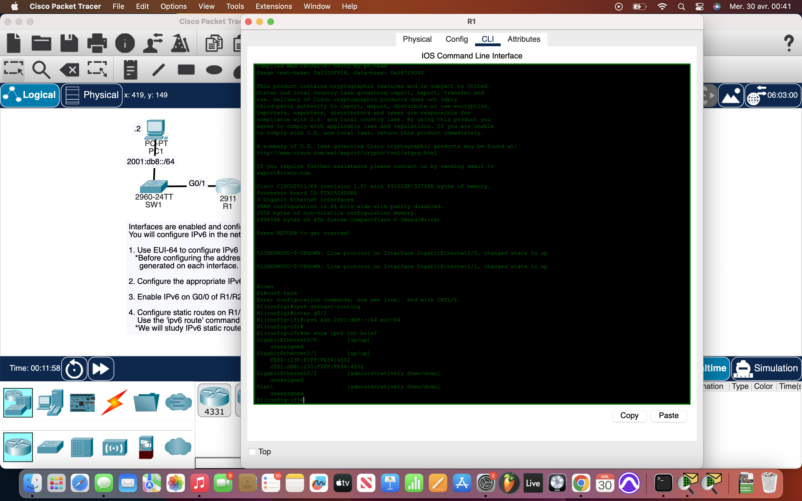
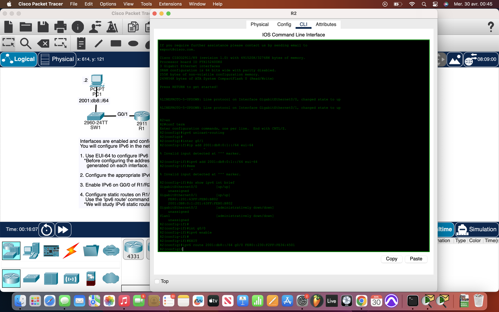
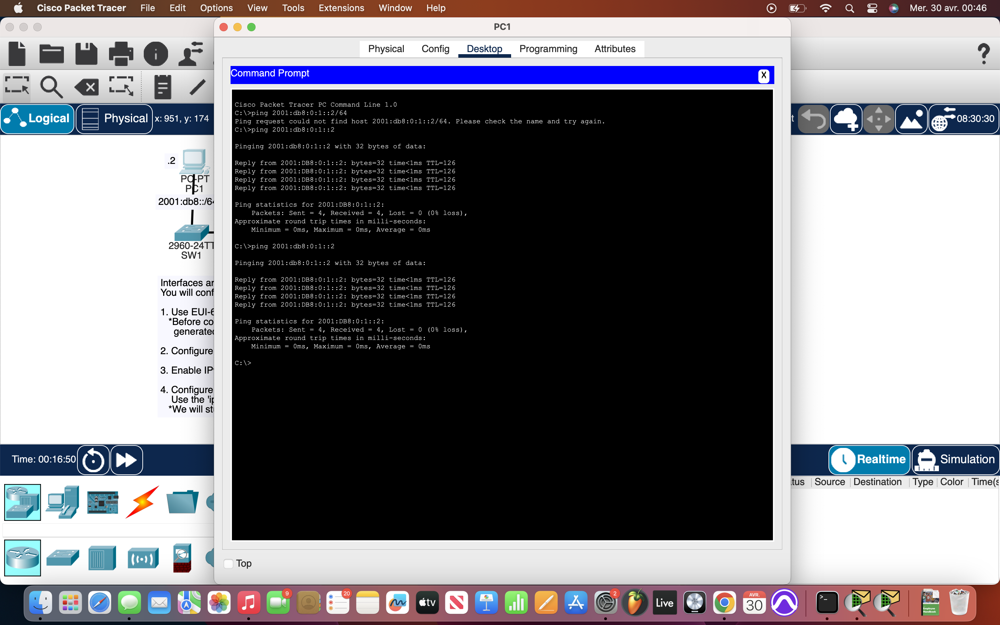

# Packet Tracer Lab 32 — IPv6 Static Routing with Link-Local Next Hops #

## Summary ##

This thirty-second Packet Tracer lab focused on **IPv6 static routing** using **link-local next hops** in a dual-router topology. The goal was to create end-to-end IPv6 connectivity across routers by configuring EUI-64 addressing, static routes, and proper gateway setup on the endpoints. Connectivity was verified via successful pings. Clean and simple.

---

## What I Did ##

- On both **R1** and **R2**, I:
  - Enabled IPv6 routing using `ipv6 unicast-routing`.
  - Assigned **IPv6 global addresses** using `ipv6 address 2001:db8::/64 eui-64` on relevant interfaces.
  - Allowed **automatic link-local generation** on interfaces (default behavior).
- On the PCs:
  - Set appropriate **IPv6 addresses** and **default gateways**.
- Configured **static routes** using the **link-local address of the neighbor router**:
  - On R2:  
    `ipv6 route 2001:db8::/64 g0/0 FE80::230:F2FF:FE36:4501`
  - On R1:  
    (respective reverse route for R2's subnet)
- Verified connectivity:
  - Ran `ping` commands from one endpoint to another — IPv6 pings worked fine.
  - IPv4 remained unchanged and still worked.

---

## Network Overview ##

Topology consisted of:

- **Two routers** (R1 and R2) connected over a **serial or gigabit link**.
- **Two PC endpoints**, one behind each router.
- Dual-stack setup:
  - IPv4 was pre-configured.
  - IPv6 was manually layered in via global unicast and static routing.
- The static routes used **link-local next-hop addresses**, showcasing a **real-world IPv6 routing strategy**.
- No dynamic routing protocols used — this was a pure **manual config test**.

---

## Screenshots ##

  

---

## Wrap-up ##

This lab was a solid introduction to **IPv6 static routing using link-local addresses** as next hops — something unique to IPv6 versus IPv4. With clean address assignment and properly scoped static routes, both IPv4 and IPv6 traffic flowed without issue. Dual-stack stayed healthy, and manual control gave clear insight into what was really happening at each hop.
