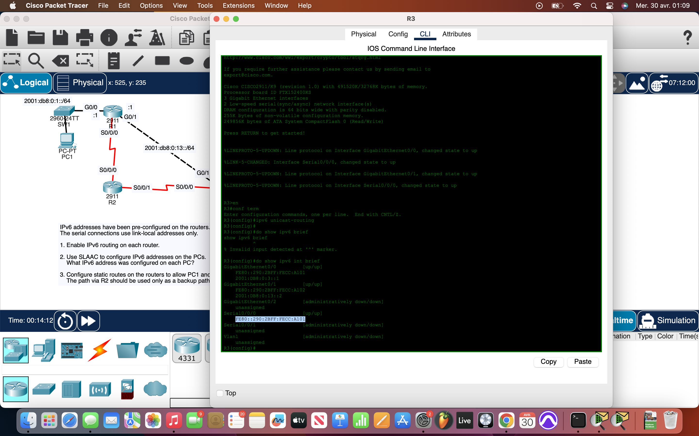
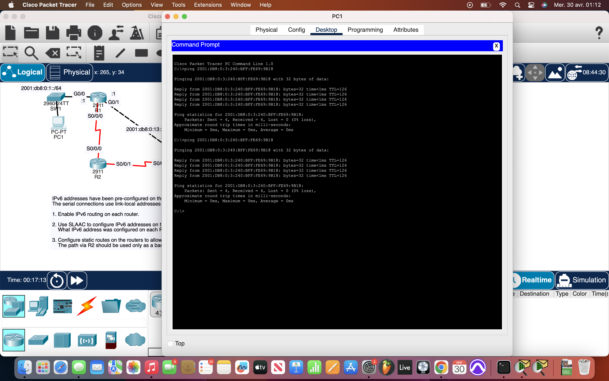

# Packet Tracer Lab 33 — IPv6 Floating Static Route with SLAAC #

## Summary ##

This thirty-third Packet Tracer lab was all about configuring **floating static routes** with **SLAAC-enabled endpoints** in an IPv6 environment. The main goal was to set up redundant routing paths — primary via Ethernet and backup via serial — ensuring full IPv6 connectivity between two endpoint zones.

---

## What I Did ##

- Enabled **IPv6 unicast routing** on all routers using:  
  `ipv6 unicast-routing`
- On each **PC**, I enabled **SLAAC (Stateless Address Autoconfiguration)**:
  - Endpoints auto-generated IPv6 addresses based on the router advertisements.
  - I confirmed each PC got an address with the correct **/64 prefix**.
- Configured two static routes on each router:
  - **Primary route** via the **Ethernet crossover** link (default administrative distance of 1).
  - **Backup route** via **serial link (S0/0/0)** using:
    ```
    ipv6 route [destination-prefix] [link-local next-hop] s0/0/0 5
    ```
    - The AD of **5** ensures this is a **floating route** — only used if the main link goes down.
- Verified routing functionality:
  - Confirmed both **IPv6 pings succeeded** between endpoints.
  - Simulated link failure to observe failover behavior (fallback worked as expected).

---

## Network Overview ##

- Three-router topology with:
  - **Ethernet crossover** as primary router interconnection.
  - **Serial links** configured with **only link-local addresses** for backup routing.
- Endpoints used **SLAAC** to generate IPv6 addresses dynamically.
- Each router had:
  - A primary static route to the remote network.
  - A **floating static route** via the serial interface with higher AD (5).
- No manual IPv6 configuration on PCs — routers handled it all via RA messages.

---

## Screenshots ##

  


---

## Wrap-up ##

This lab was a clean example of **IPv6 failover logic** using floating static routes — a critical real-world mechanism for redundancy. Combined with SLAAC for endpoint addressing, it showed how hands-off client config and smart routing can still provide robust, fault-tolerant networking without needing complex protocols.
