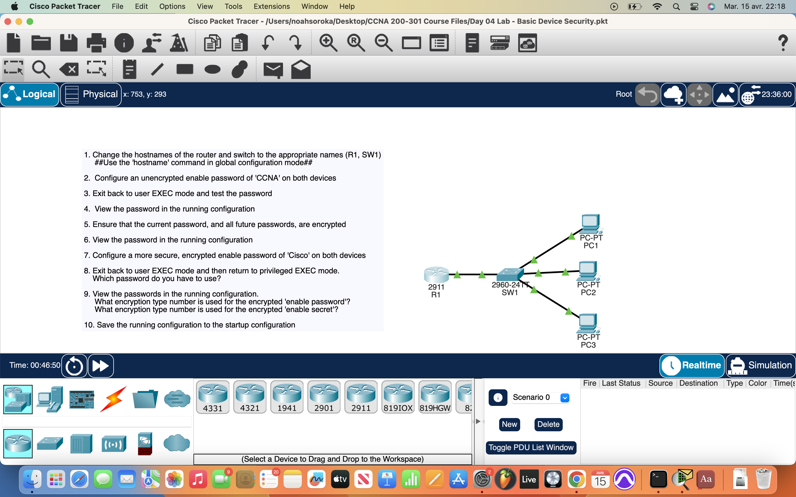
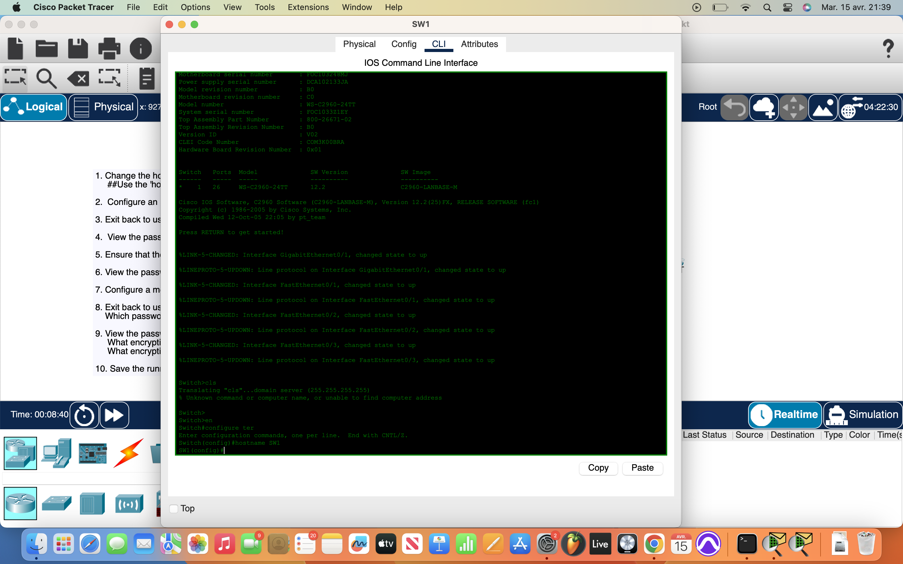

# Packet Tracer Lab 4 — Cisco CLI, Hostname Configuration, and Privilege Escalation #

---

## Summary ##

In this session, I familiarized myself with the **Cisco CLI** and explored its features for network device management. I performed several administrative tasks such as changing the hostname of devices, configuring passwords with encryption, and escalating my privileges from normal user mode to privileged execution mode (pExec) and global configuration mode (GCM). I also examined password configurations in the running-config file and merged it into the startup configuration at the end.

---

## What I Did ##

- **Changed the hostname** of network devices to better reflect their role in the network.
- **Configured passwords** for the device access and applied encryption using the **`enable secret`** command to ensure secure password handling.
- **Escalated privileges** through the CLI:
  - Started at normal user mode and escalated to **pExec** (privileged exec mode) using the **`enable`** command.
  - Further escalated to **GCM** (global configuration mode) to configure device settings.
- **Examined password encryption** by viewing the passwords in the running-config file and confirming the encryption was applied.
- **Merged the running-config** into the startup configuration to ensure changes persisted after a reboot.

---

## Network Overview ##

The lab involved the use of multiple **network devices** such as routers and switches:

- Each device had its hostname configured for easier identification.
- Passwords were set up on devices for access control.
- The configuration was tested by ensuring the correct password encryption and privilege levels were set across devices.
- The running configuration was successfully merged into the startup configuration to retain settings upon reboot.

---

## Screenshots ##

  
  

---

## Wrap-up ##

This lab was focused on familiarizing myself with the Cisco CLI and understanding how to configure basic security features such as passwords and encryption. By experimenting with privilege escalation and inspecting configuration files, I learned the importance of securing access to devices and ensuring configurations persist through reboots.
