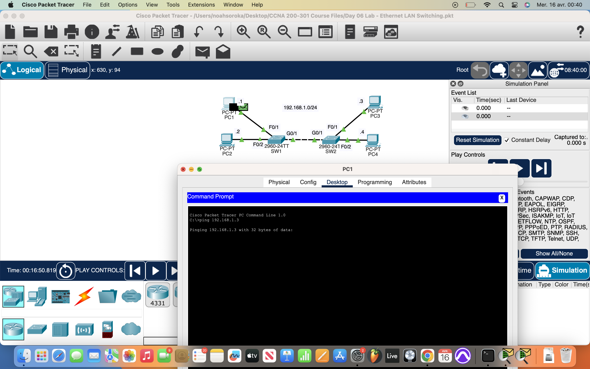
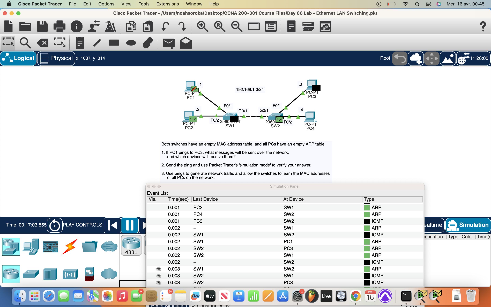
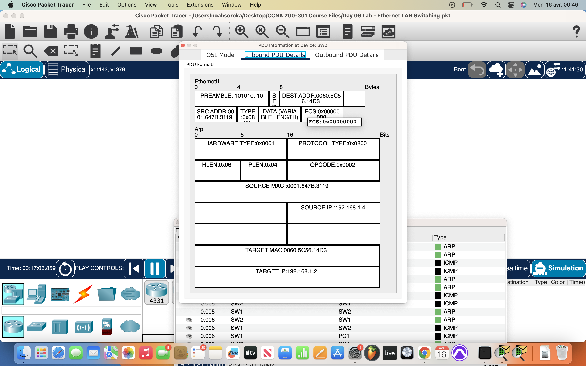
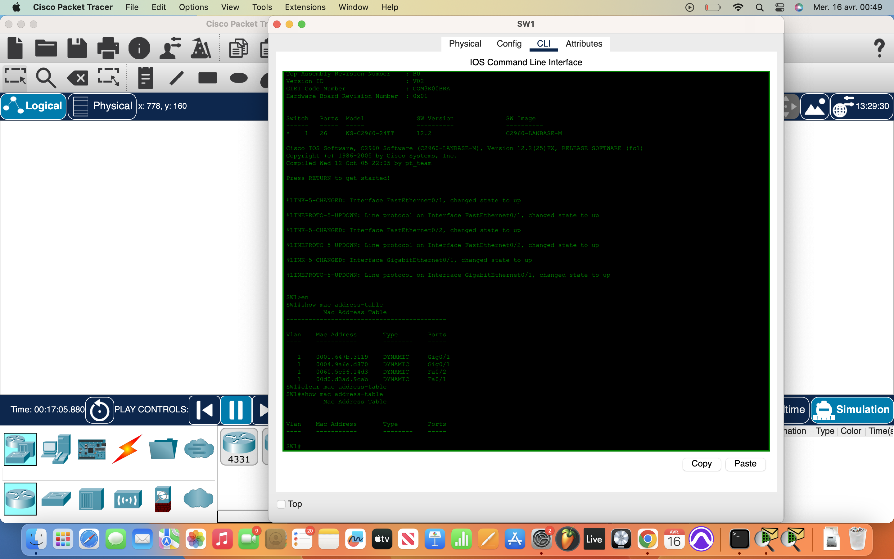

# Packet Tracer Lab 5/6 — MAC Address Tables & Network Traffic

---

## Summary ##

In this lab, I explored how network traffic impacts the MAC address table and how devices learn MAC addresses dynamically. By using the **ping** command within the endpoint CLIs, I generated traffic that allowed the switches to populate their MAC tables. I also observed flooding for the first time as the switch learned unknown MAC addresses. Additionally, I examined the **ARP table** and utilized privilege escalation to manage the MAC address table on the switches.

---

## What I Did ##

- Used the **ping command** on all 4 workstations to generate network traffic, allowing switches to populate their MAC address tables.
- Observed **flooding** when the switch didn't have knowledge of the destination MAC addresses, leading to broadcast packets to all ports.
- After pings were sent, the **ARP table** on the endpoints was updated with corresponding IP-MAC mappings.
- Consulted the switches via CLI, elevated my privileges, and checked the **MAC address table** using commands like `show mac address-table`.
- Cleared the **dynamic MAC entries** from the switch's MAC address table to simulate a fresh start and test the learning process again.

---

## Network Overview ##

The lab setup included:

- **4 workstations** (endpoints), each configured with an IP and MAC address.
- **Two switches** connecting the workstations, forming the network topology.
- **Switch flooding** was observed as the switches learned new MAC addresses after the **ping** traffic was generated.
- The **ARP table** on the endpoints reflected the updated MAC-IP mappings after communication between workstations.

The primary goal of the lab was to understand the role of the MAC address table and how switches dynamically populate it based on network traffic.

---

## Screenshots ##

  
  
  
  
  
  

---

## Wrap-up ##

This lab focused on understanding how switches dynamically populate the MAC address table as network traffic flows. I learned how to interact with the switches' CLI to view and manage the MAC address table, including clearing dynamic entries. The exercise also highlighted the impact of flooding when switches don’t have the destination MAC address, and how ARP tables on endpoints are updated through network traffic.
