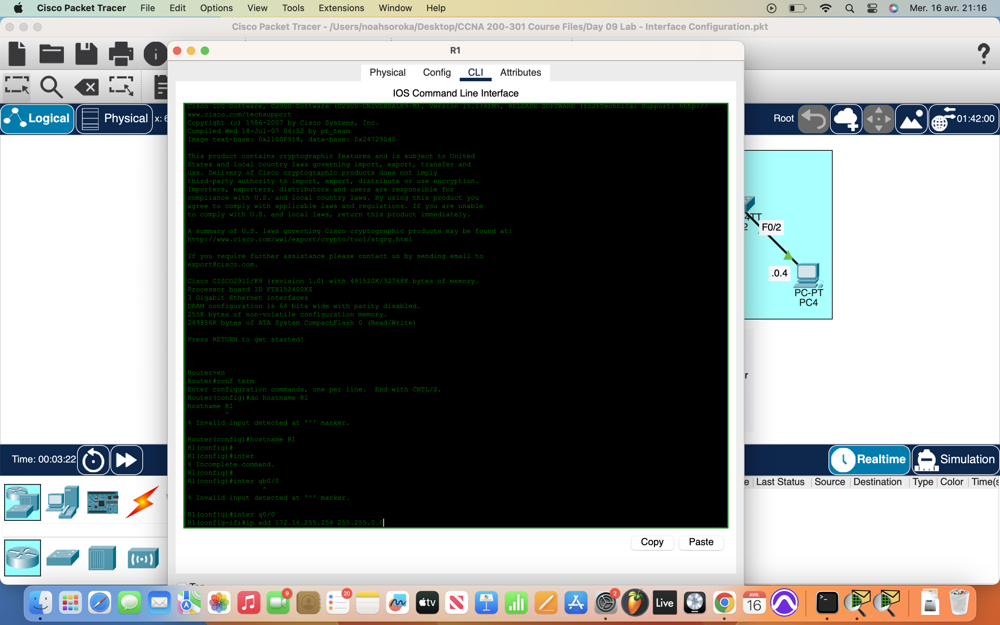
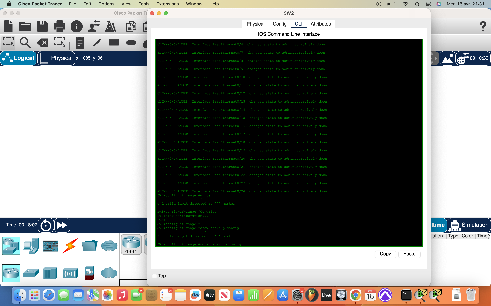

# Packet Tracer Lab 9 — Interface Configuration & Management

---

## Summary ##

In this lab, I focused on configuring device interfaces, assigning IP addresses, managing unused ports, and verifying network connectivity. I applied key switch and router configuration commands in global and interface configuration modes. The lab emphasized using correct duplex/speed settings on inter-device links, assigning descriptions to interfaces, and cleaning up unused ports by disabling them. I also ensured changes were saved persistently using `copy running-config startup-config`.

---

## What I Did ##

- Entered global configuration mode using `en` and `conf t` on **R1**, **SW1**, and **SW2**.
- Changed the device names using the `hostname` command for easier identification.
- Configured the IP addresses on **R1**, **PC1**, **PC2**, **PC3**, and **PC4** based on the lab topology.
- Assigned IP addresses directly on PCs via their GUI, and on R1 via interface configuration.
- Entered each active interface with `interface <name>` and configured:
  - Speed and duplex manually on connections between networking devices (e.g., switch-to-router).
  - Descriptions to reflect connected devices or purposes.
- Used `interface range` to select all unused interfaces on each switch and applied:
  - `shutdown` to disable them.
  - `description Not in use` for clarity.
- Verified interface status with `show ip interface brief` and confirmed effects took place.
- Saved the configuration using `copy running-config startup-config` to ensure settings persist after a reboot.

---

## Network Overview ##

The lab included the following elements:

- **1 router (R1)** and **2 switches (SW1 and SW2)** connected in a basic topology.
- **4 endpoints (PC1–PC4)** connected to the switches.
- Interfaces between switches and router were manually set to appropriate speed and duplex settings.
- IP addressing was applied according to the diagram, enabling end-to-end connectivity.
- Unused switch interfaces were administratively disabled to improve security and management.

---

## Screenshots ##

  
  
  

---

## Wrap-up ##

This lab helped reinforce practical CLI configuration on switches and routers, especially regarding interface-level management. I got comfortable with using interface ranges, setting speeds and duplex modes, and disabling unused ports. I also validated configurations through basic verification commands and learned the importance of saving work to the startup config for persistence.
