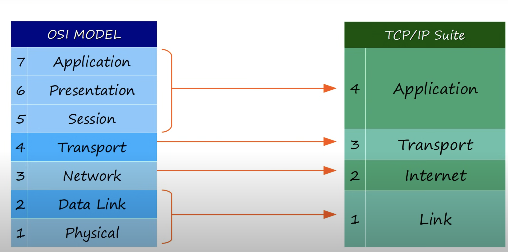

# OSI Model & TCP/IP Suite

---

### What is a networking model? ###

A networking model categorize and provide a structure for networking protocols and standards. A networking protocol is a set of rules defining how network devices and software should work together.

## OSI Model ###

OSI stands for Open System for Interconnection, open referring to open standard, non-proprietary. It a conceptual model that categorizes and standardizes the different functions in a network.
The OSI model is divided into 7 distinct layers:

#### * Application Layer ####

The application layer is the 7th and therefore closest to the enduser. The application layer interacts with software applications that have a communication component. 
For example, HTTP & HTTP W SSL/TLS are level 7 protocols.
Functions of layer 7 are: identifying communication partners & synchronizing communication.

### Encapsulation

Encapsulation is when data is processed through the OSI stack, each layer adding something to the original data. The neighboring system performs the opposite process, the layers are stripped off, this is called de-encapsulation.
Both encapsulation and de-encapsulation processes are examples of adjacent-layer interaction. However, communication between application layers of the two different systems is called same-layer communication.

#### * Presentation Layer ####

Data in the application is in an application format and needs to be translated to a different format to be sent over the network. The presentation layer's job is to translate between application and network formats.
Presentation layer is charged with the encryption of data in transit, and decryption so only the parties exchanging it can read said data.
To summarize, the presentation layer translates data to the appropriate format.

#### * Session Layer ####

The session layer control dialogues/sessions between communicating hosts. It establishes, manages and terminates connections between the local application (your web browser) and the remote application (YouTube).

#### * Transport Layer ####

Breaks large pieces of data into smaller segments which can be easily sent over the network. 
The transport layer provides host-to-host communication, also known as end-to-end communication, or process-to-process communication for applications.
A layer 4 header is applied to the data, called a segment.

#### * Network Layer ####

After the segments are sent down to the level 3 network layer, the layer 3 header is added on to the end after the level 4 headers. 
The network layer provides connectivity between endpoints on different networks, for example: outside of the LAN.
Layer 3 provides logical addressing in the form of IP addresses. It also provides path selection between source and destination. Routers therefore operate at layer 3.
The combination of layer 4 and layer 3 headers encapsulating data is called a <b>packet</b>

#### * Data Link Layer ####

Next, the layer 2 further encapsulates it with a layer 2 header and layer 2 trailer. This is now called a frame.
Layer 2 is the data-link layer which provides node-to-node connectivity and data transfer between nodes. It also defines how data is formatted for transmission over a physical medium.
Data-link layer also detects and possibly corrects errors that occur on the physical layer itself. Layer 2 uses an addressing system called MAC. 
Switches operate at layer 2, looking at the destination layer 2 address to send the data.

#### * Physical Layer 

The physical layer defines physical characteristics of the medium used to transfer data between devices. Examples are: maximum cable run distance, voltage levels, physical connectors, cable specs, etc...
Digital bits are converted to electrical pulses for wired connections or radiowave modulation for WiFi, known as signals.

### PDU'S (Protocol Data Units ###
PDU (Protocol Data Unit) is the data packet at each layer of the OSI model, representing the encapsulated information as it moves through different layers.  
At each layer, the PDU takes on a different form, such as a "frame" at Layer 2, a "packet" at Layer 3, and a "segment" at Layer 4.

###### Acronym for OSI : Please Do Not Teach Students Pointless Acronyms ######

## TCP/IP Networking Stack vs OSI

---
