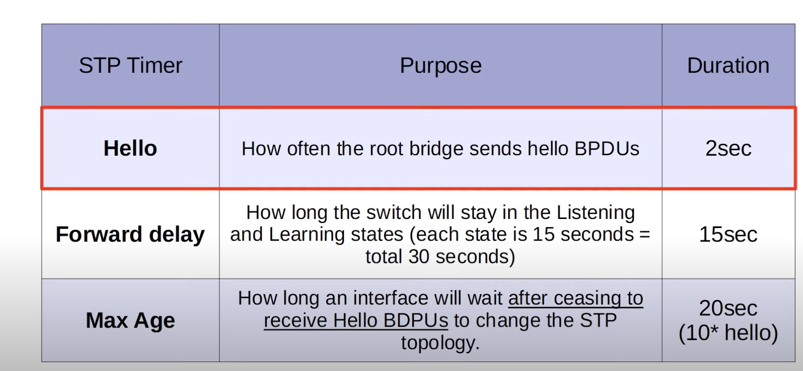

# STP Toolkit

---

## Port states

* Non-designated ports are in a **blocking state**. Interfaces in a blocking state are disabled by STP to prevent L2 loops. Any traffic will be blocked, but BPDU's will be received to be aware of the STP topology.
* After the blocking state, interfaces with the designated or root role enter the **listening state**. The listening state is 15 seconds long by default determined by the FDT (Forward Delay Timer). A listening only forwards and receives BPDU's.
* After the listening state, a designated or root port will enter the **learning state** which is 15 seconds long by default by the FDT. It only forwards/receives BPDU's but also remembers MAC addresses from traffic over the interface unlike listening state.
* Forwarding state ports are designated and root ports when stable. A port in the **forwarding state** sends and receives BPDU's, let's traffic go through, learns MAC addressses. A switchport running as normal.
* Disabled just means that the port was administratively disabled using ```no shutdown``` in the interface menu.

### Timers

  

## PVST types

* PVST: older version, only ISL trunking, MAC address: 0180.c200.0000
* PVST+: newer version, supports dot1q trunking, MAC address: 01:00:0c:cc:cc:cd

## BPDU header

First three fields: Protocol ID ---> 0x0000 for STP
Protocol Version ID ---> 0 for Standard STP
BPDU type ---> 0x00 for configuration BPDU

## ClI commands

```spanning-tree mode ?``` will show mst (multiple STP), pvst (PerVLAN STP), rpvst (Rapid PVST)
```spanning-tree vlan 1 root primary``` sets the STP priority to 24576, if another SW is below this, it sets it 4096 below that bridge ID.
```spanning-tree vlan 1 root secondary``` sets the STP priority to 28672 or lower.

---

# Portfast #

### What is the problem that Portfast solves?

When an endhost connects to a switch interface, the port becomes up/up but cannot send or receive data yet because of STP and it's state.
The listening and learning states both take 15 seconds respectively to complete to allow BPDU hello's to have enough time to shut down this connection if it is dangerous to the network topology.
This wait is unnecessary and just extra precaution as endhosts cannot even create L2 loops in a network topology.

### How PortFast works

When Portfast is configured on a port, the port enters the designated forwarding state as soon as it is connected to another device, bypassing the 30 seconds.
Whatever you do, DO NOT configure Portfast on trunking links between switches as that will most likely crash the network because of its inherent instant trust bypassing BPDU hellos.

* enter interface config-if + ```spanning-tree portfast``` hard-enables portfast on that specific port, should be connected to an endpoint
* global config + ```spanning-tree portfast default``` hard-enables portfast on all access ports on the switch. config-if + ```spanning-tree portfast disable``` will deactive portfast on a single port.

### Portfast and Trunk Ports

There are usecases for enabling portfast on trunk ports, for example to connect a server hosting VMs in multiple Vlans, or a ROAS trunk link between the SW and Router.
```spanning-tree portfast trunk``` is config per-port in interface config mode/config-if and it cannot be done globally.

---

# BPDU Guard & BPDU Filter #

## What is BPDU Guard?

BPDU Guard protects the network from unauthorized switches being connected to ports intended for endpoints. BPDU guard can be connected seperately from Portfast, but both are usually used together as they enhance STP's functionality.
BPDU Guard enabled ports continue to send BPDU's, but if it receives a BPDU, it will error disable its egress endpoint port.

### How BPDU Guard works

* Per-port: config-if + ```spanning-tree bpduguard enable```
* Default globally: global config + ```spanning-tree bpuguard default```. However, when you enable default BPDU-guard it is enabled on all Portfast ports, NOT access ports.

ERRDISABLE is a Cisco IOS switch feature that disables a port automatically under certain violations, like BPDU guard infraction. Other violations are DAI, Port Policing, Port Security, etc...
Disconnecting the Ethernet from the ERRDISABLED port will not solve the issue. We first want to fix the issue, and then admin reactivate the port. You can use no shutdown or shutdown.
Or you can use ERRDISABLE recovery, use ```do show errdisable recovery```. The list shows violation reasons, the default recovery timer is 5 minutes. You can modify this by using ```errdisable recovery interval (seconds)```
To enable ERRDISABLE recovery, use ```errdisable recovery cause (causetype).

## What is BPDU Filter?

BPDU Filter entirely just stops the ports connected to endpoints from even sending 2second beacon BPDU hello's. This is to save bandwidth and promote maximum security as endhosts can learn about the intranet topology using the BPDU's.

### How BPDU Filter works

* Per-port: config-if + ```spanning-tree bpdufilter enable```. The port will now NOT send BPDU's to endpoints or other devices on that port and it will now NOT accept any incoming BPDU's.
* Default globally + ```spanning-tree bpdufilter default```. This will be activated on all Portfast enabled ports. This is different from per-port config as it does NOT send BPDU's but will react accordingly when it receives new BPDU's.

---

# Loopguard & Rootguard #

## What is Loopguard?

Loopguard protects the network from potential network loops that could arise if a port stops receiving BPDUs (Bridge Protocol Data Units). It is useful when there is a risk of a port transitioning into a forwarding state due to a missing BPDU. It works by forcing the port to enter a loop-inconsistent state if it stops receiving BPDUs, preventing network instability and loops.

### How Loopguard works

* Per-port: config-if + ```spanning-tree loopguard default``` or ```spanning-tree loopguard enable```
* Default globally: global config + ```spanning-tree loopguard default```. This enables Loopguard on all ports, even non-Root ports.

When Loopguard is enabled, if a port doesn't receive BPDUs for a specific period (usually 3 Hello timers), it will go into a "loop-inconsistent" state. This state blocks the port from forwarding traffic, preventing the risk of a network loop. If BPDUs are received again, the port will return to its normal state.

## What is Rootguard?

Rootguard is a Cisco feature used to prevent an inferior switch from becoming the root of the spanning tree. This feature allows you to designate certain ports that should never become the root port, even if they receive BPDUs with a better (lower) bridge ID.

### How Rootguard works

* Per-port: config-if + ```spanning-tree guard root```
* Default globally: global config + ```spanning-tree guard root```. This enables Rootguard on all ports by default.

When Rootguard is enabled, if a switch port receives a BPDU indicating a better root switch (with a lower bridge ID), it will immediately move that port into a "root-inconsistent" state. In this state, the port is blocked from forwarding traffic and will not participate in becoming the root port. The port will only recover to a normal forwarding state if the superior BPDU stops arriving.

  
